# SỔ TAY HƯỚNG DẪN SỬ DỤNG HỆ THỐNG QUẢN LÝ THIẾT BỊ & TÀI SẢN CNTT
> **Dành cho**: Cán bộ Quản lý Tài sản, Nhân sự, Kế toán, Thủ kho và Người sử dụng không chuyên CNTT.  
> **Phiên bản tài liệu**: 2.0 (Cập nhật giao diện tiếng Việt & Hình ảnh thực tế)  
> **Hệ thống**: Snipe-IT Asset Management

---

## LỜI NÓI ĐẦU & BẢNG GIẢI NGHĨA THUẬT NGỮ "BÌNH DÂN"

Để giúp các anh/chị **không am hiểu về Công nghệ thông tin** vẫn có thể quản lý, cấp phát và theo dõi thiết bị một cách dễ dàng và chính xác nhất, tài liệu này được biên soạn theo nguyên tắc: **Cầm tay chỉ việc - Nhìn hình làm theo - Không dùng từ ngữ kỹ thuật khó hiểu**.

Trước khi bắt đầu, hãy cùng làm quen với các khái niệm cốt lõi trong hệ thống qua bảng so sánh thực tế dưới đây:

| Thuật ngữ hệ thống | Tên tiếng Việt | Ví dụ thực tế dễ hiểu | Quy tắc quản lý |
| :--- | :--- | :--- | :--- |
| **Hardware / Asset** | **Tài sản / Thiết bị** | Máy tính bàn (PC), Laptop, Màn hình, Máy in, Máy chấm công, Máy chiếu... | Mỗi cái có **01 Mã số định danh (Asset Tag)** và **01 Số Sê-ri (Serial)** riêng biệt. Phải theo dõi ai đang giữ. |
| **Checkout** | **Cấp phát / Bàn giao** | Giao laptop cho nhân viên mới, chuyển máy in sang phòng Kế toán. | Ghi nhận đích danh người nhận hoặc phòng ban nhận chịu trách nhiệm. |
| **Checkin** | **Thu hồi / Trả về kho** | Nhân viên nghỉ việc trả lại laptop, thu hồi máy cũ về kho cất. | Chuyển trạng thái máy về lại trong kho để sẵn sàng cấp cho người tiếp theo. |
| **Licenses** | **Bản quyền / Giấy phép** | Khóa bản quyền Windows 11, Microsoft Office 365, Adobe Photoshop... | Quản lý số lượng máy/người được phép kích hoạt (gọi là Chỗ / Seats). |
| **Accessories** | **Phụ kiện** | Chuột máy tính, bàn phím, sạc laptop, tai nghe, túi chống sốc... | Được phát cho nhân viên sử dụng, **có thể thu hồi** lại khi họ không dùng nữa. |
| **Consumables** | **Vật tư tiêu hao** | Hộp mực máy in, ram giấy in A4, đầu bấm mạng RJ45, pin tiểu... | Phát ra là dùng hết, **không thu hồi** lại về kho. |
| **Components** | **Linh kiện** | Thanh RAM, ổ cứng SSD, card màn hình đồ họa... | Linh kiện lắp đặt **bên trong** một máy tính để nâng cấp máy. |
| **Predefined Kits** | **Gói thiết bị mẫu** | "Combo nhân viên mới" gồm: 1 Laptop + 1 Chuột + 1 Bản quyền Office. | Cấp phát 1 chạm cả bộ thay vì phải đi tìm bàn giao từng món. |
| **Maintenances** | **Bảo trì / Sửa chữa** | Máy tính bị vỡ màn hình gửi đi bảo hành, máy in bị kẹt giấy gọi thợ sửa... | Theo dõi lịch sử hỏng hóc, đơn vị sửa chữa và chi phí phát sinh. |
| **Status Labels** | **Trạng thái tài sản** | "Sẵn sàng cấp phát", "Đang chờ cài đặt", "Đang sửa chữa", "Đã thanh lý"... | Nhìn vào là biết ngay tài sản này đang nằm ở đâu, có dùng được không. |

---

## MỤC LỤC CHI TIẾT

1. [PHẦN 1: ĐĂNG NHẬP & TỔNG QUAN HỆ THỐNG](#phần-1-đăng-nhập--tổng-quan-hệ-thống)
   - [Bước 1.1: Đăng nhập vào hệ thống](#bước-11-đăng-nhập-vào-hệ-thống)
   - [Bước 1.2: Làm quen Bảng điều khiển (Dashboard)](#bước-12-làm-quen-bảng-điều-khiển-dashboard)
   - [Bước 1.3: Thanh tìm kiếm nhanh & Menu điều hướng bên trái](#bước-13-thanh-tìm-kiếm-nhanh--menu-điều-hướng-bên-trái)
2. [PHẦN 2: QUẢN LÝ THIẾT BỊ & TÀI SẢN (HARDWARE / ASSETS)](#phần-2-quản-lý-thiết-bị--tài-sản-hardware--assets)
   - [Bước 2.1: Xem và tìm kiếm danh sách tài sản](#bước-21-xem-và-tìm-kiếm-danh-sách-tài-sản)
   - [Bước 2.2: Thêm mới một thiết bị khi vừa mua về](#bước-22-thêm-mới-một-thiết-bị-khi-vừa-mua-về)
   - [Bước 2.3: Cấp phát thiết bị (Bàn giao cho nhân viên)](#bước-23-cấp-phát-thiết-bị-bàn-giao-cho-nhân-viên)
   - [Bước 2.4: Thu hồi thiết bị (Nhận lại máy khi nghỉ việc/đổi máy)](#bước-24-thu-hồi-thiết-bị-nhận-lại-máy-khi-nghỉ-việcđổi-máy)
   - [Bước 2.5: Xem lý lịch & lịch sử sử dụng của thiết bị](#bước-25-xem-lý-lịch--lịch-sử-sử-dụng-của-thiết-bị)
   - [Bước 2.6: In nhãn dán mã vạch / QR Code lên thân máy](#bước-26-in-nhãn-dán-mã-vạch--qr-code-lên-thân-máy)
3. [PHẦN 3: QUẢN LÝ BẢN QUYỀN PHẦN MỀM (LICENSES)](#phần-3-quản-lý-bản-quyền-phần-mềm-licenses)
   - [Bước 3.1: Xem danh mục bản quyền phần mềm](#bước-31-xem-danh-mục-bản-quyền-phần-mềm)
   - [Bước 3.2: Khai báo gói bản quyền phần mềm mới](#bước-32-khai-báo-gói-bản-quyền-phần-mềm-mới)
   - [Bước 3.3: Cấp phát bản quyền cho nhân viên](#bước-33-cấp-phát-bản-quyền-cho-nhân-viên)
4. [PHẦN 4: QUẢN LÝ PHỤ KIỆN (ACCESSORIES)](#phần-4-quản-lý-phụ-kiện-accessories)
   - [Bước 4.1: Xem danh mục phụ kiện và tồn kho](#bước-41-xem-danh-mục-phụ-kiện-và-tồn-kho)
   - [Bước 4.2: Thêm mới phụ kiện vào kho](#bước-42-thêm-mới-phụ-kiện-vào-kho)
   - [Bước 4.3: Cấp phát phụ kiện cho nhân viên](#bước-43-cấp-phát-phụ-kiện-cho-nhân-viên)
5. [PHẦN 5: QUẢN LÝ VẬT TƯ TIÊU HAO (CONSUMABLES)](#phần-5-quản-lý-vật-tư-tiêu-hao-consumables)
   - [Bước 5.1: Theo dõi tồn kho vật tư tiêu hao](#bước-51-theo-dõi-tồn-kho-vật-tư-tiêu-hao)
   - [Bước 5.2: Khai báo nhập thêm vật tư tiêu hao](#bước-52-khai-báo-nhập-thêm-vật-tư-tiêu-hao)
   - [Bước 5.3: Xuất kho vật tư cho nhân viên / phòng ban](#bước-53-xuất-kho-vật-tư-cho-nhân-viên--phòng-ban)
6. [PHẦN 6: QUẢN LÝ LINH KIỆN NÂNG CẤP (COMPONENTS)](#phần-6-quản-lý-linh-kiện-nâng-cấp-components)
   - [Bước 6.1: Xem danh sách linh kiện trong kho](#bước-61-xem-danh-sách-linh-kiện-trong-kho)
   - [Bước 6.2: Khai báo linh kiện mới](#bước-62-khai-báo-linh-kiện-mới)
   - [Bước 6.3: Lắp ráp / Gán linh kiện vào một máy tính cụ thể](#bước-63-lắp-ráp--gán-linh-kiện-vào-một-máy-tính-cụ-thể)
7. [PHẦN 7: GÓI THIẾT BỊ MẪU / COMBO NHÂN VIÊN MỚI (PREDEFINED KITS)](#phần-7-gói-thiết-bị-mẫu--combo-nhân-viên-mới-predefined-kits)
   - [Bước 7.1: Xem danh sách gói thiết bị mẫu](#bước-71-xem-danh-sách-gói-thiết-bị-mẫu)
   - [Bước 7.2: Cấp phát 1 chạm cả gói combo cho nhân viên mới](#bước-72-cấp-phát-1-chạm-cả-gói-combo-cho-nhân-viên-mới)
8. [PHẦN 8: THEO DÕI BẢO TRÌ & SỬA CHỮA (MAINTENANCES)](#phần-8-theo-dõi-bảo-trì--sửa-chữa-maintenances)
   - [Bước 8.1: Xem sổ theo dõi sửa chữa và bảo hành](#bước-81-xem-sổ-theo-dõi-sửa-chữa-và-bảo-hành)
   - [Bước 8.2: Lập phiếu báo hỏng / gửi bảo trì thiết bị](#bước-82-lập-phiếu-báo-hỏng--gửi-bảo-trì-thiết-bị)
9. [PHẦN 9: QUẢN LÝ NHÂN VIÊN / NGƯỜI DÙNG (USERS)](#phần-9-quản-lý-nhân-viên--người-dùng-users)
   - [Bước 9.1: Tra cứu danh sách nhân viên](#bước-91-tra-cứu-danh-sách-nhân-viên)
   - [Bước 9.2: Tạo hồ sơ nhân viên mới](#bước-92-tạo-hồ-sơ-nhân-viên-mới)
   - [Bước 9.3: Xem toàn bộ tài sản nhân viên đang nắm giữ](#bước-93-xem-toàn-bộ-tài-sản-nhân-viên-đang-nắm-giữ)
10. [PHẦN 10: THIẾT LẬP DANH MỤC NỀN TẢNG (CATEGORIES, LOCATIONS, STATUS)](#phần-10-thiết-lập-danh-mục-nền-tảng-categories-locations-status)
    - [Bước 10.1: Quản lý Loại tài sản (Categories)](#bước-101-quản-lý-loại-tài-sản-categories)
    - [Bước 10.2: Quản lý Vị trí / Chi nhánh (Locations) & Phòng ban](#bước-102-quản-lý-vị-trí--chi-nhánh-locations--phòng-ban)
11. [PHẦN 11: BÁO CÁO, KHẤU HAO & NHẬT KÝ HOẠT ĐỘNG (REPORTS)](#phần-11-báo-cáo-khấu-hao--nhật-ký-hoạt-động-reports)
    - [Bước 11.1: Báo cáo khấu hao giá trị tài sản](#bước-111-báo-cáo-khấu-hao-giá-trị-tài-sản)
    - [Bước 11.2: Xem Nhật ký hoạt động (Ai làm gì, vào lúc nào)](#bước-112-xem-nhật-ký-hoạt-động-ai-làm-gì-vào-lúc-nào)

---

# PHẦN 1: ĐĂNG NHẬP & TỔNG QUAN HỆ THỐNG

### Bước 1.1: Đăng nhập vào hệ thống

- **Mục đích**: Xác thực danh tính người dùng để truy cập vào phần mềm.
- **Cách thực hiện**:
  1. Mở trình duyệt web (Google Chrome, Microsoft Edge, Cốc Cốc...).
  2. Gõ địa chỉ phần mềm (Ví dụ nội bộ: `http://127.0.0.1:8000` hoặc tên miền do IT cung cấp).
  3. Nhập **Tên người dùng (Username)** hoặc **Email**.
  4. Nhập **Mật khẩu (Password)** của bạn.
  5. Tích chọn ô *"Ghi nhớ đăng nhập"* nếu bạn đang dùng máy tính cá nhân.
  6. Nhấn nút xanh **Đăng nhập**.

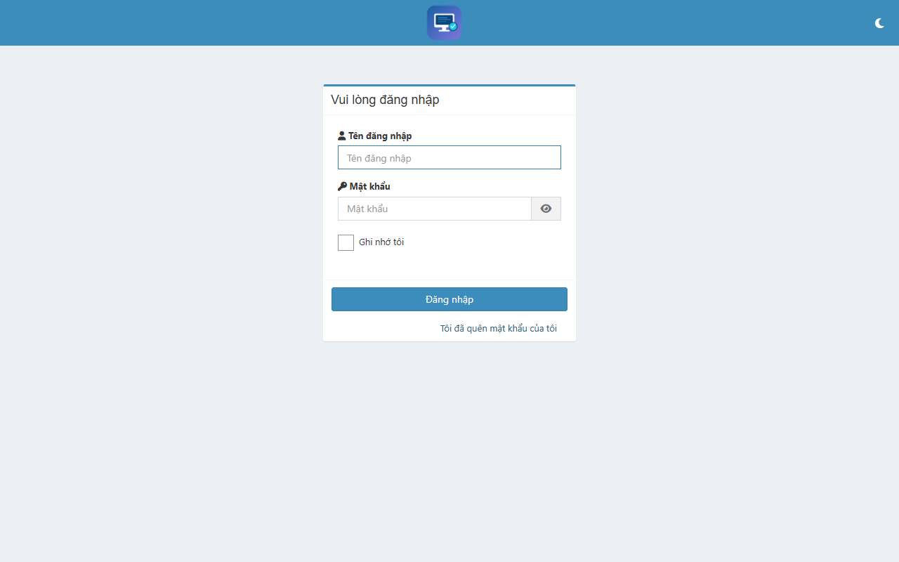

> **Mẹo nhỏ**: Nếu nhập sai mật khẩu quá số lần quy định, hệ thống sẽ tạm khóa tài khoản trong 15 phút để đảm bảo an toàn. Khi đó hãy liên hệ quản trị viên IT để được hỗ trợ mở khóa nhanh.

---

### Bước 1.2: Làm quen Bảng điều khiển (Dashboard)

- **Mục đích**: Nắm bắt bức tranh tổng thể về tài sản toàn công ty trong vòng 3 giây ngay khi đăng nhập.
- **Ý nghĩa các khối số liệu trên màn hình**:
  - **Khối Xanh dương (Tổng tài sản)**: Tổng tất cả số máy móc, thiết bị hiện có trong công ty.
  - **Khối Xanh lá (Đã cấp phát)**: Số lượng thiết bị đang được nhân viên hoặc phòng ban sử dụng thực tế.
  - **Khối Vàng cam (Sẵn sàng cấp phát)**: Số thiết bị đang nằm sẵn trong kho, hoạt động tốt, sẵn sàng đem bàn giao ngay cho nhân viên mới.
  - **Khối Đỏ (Cần sửa chữa / Chờ xử lý)**: Thiết bị đang bị hỏng hóc, đang bảo hành hoặc đang chờ cài đặt kỹ thuật.

---

### Bước 1.3: Thanh tìm kiếm nhanh & Menu điều hướng bên trái

- **Mục đích**: Tìm kiếm tài sản tức thì hoặc chuyển qua lại giữa các phân hệ chức năng.
- **Cách thực hiện**:
  - **Menu bên trái (Sidebar)**: Xếp theo từng nhóm nghiệp vụ rõ ràng: *Tài sản, Giấy phép, Phụ kiện, Vật tư tiêu hao, Linh kiện, Gói thiết bị mẫu, Người dùng, Cài đặt*. Bấm vào mục nào sẽ mở ra bảng quản lý của mục đó.
  - **Thanh tìm kiếm nhanh (Góc trên cùng)**: Chỉ cần gõ mã tài sản (Ví dụ `TS-CNTT-001`), số sê-ri máy hoặc tên nhân viên rồi nhấn `Enter`, hệ thống sẽ trả về kết quả ngay lập tức.
  - **Nút Tạo mới nhanh (+ Tạo mới)**: Nằm ở thanh tiêu đề trên cùng, cho phép bấm vào là tạo ngay tài sản, người dùng hoặc bản quyền mà không cần đi qua nhiều trang.

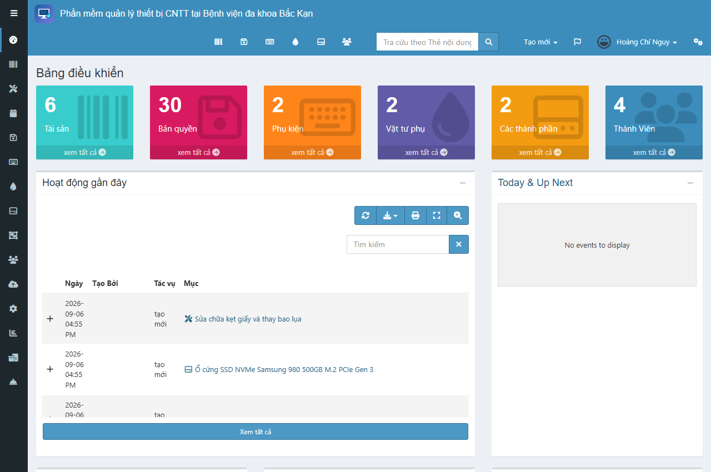

---

# PHẦN 2: QUẢN LÝ THIẾT BỊ & TÀI SẢN (HARDWARE / ASSETS)

*(Áp dụng cho: Laptop, Máy tính để bàn PC, Màn hình, Máy in, Máy chiếu, Thiết bị mạng...)*

### Bước 2.1: Xem và tìm kiếm danh sách tài sản

- **Mục đích**: Kiểm tra công ty hiện có những máy móc nào, ai đang dùng chiếc máy nào, máy nào còn trống trong kho.
- **Thao tác**:
  1. Trên menu bên trái, nhấp chuột vào mục **Tài sản** -> chọn **Xem tất cả**.
  2. Tại bảng danh sách:
     - Cột **Tên tài sản & Mã tài sản**: Định danh của thiết bị.
     - Cột **Mẫu mã (Model)**: Loại máy (Ví dụ: Dell Latitude 5420, MacBook Pro M2).
     - Cột **Trạng thái**: Thể hiện màu sắc trực quan (Xanh lá = Sẵn sàng; Xanh dương = Đang cấp phát; Cam = Đang bảo trì).
     - Cột **Được thanh toán tới**: Tên nhân viên đang giữ máy.
     - Ô **Tìm kiếm** (góc phải trên bảng): Gõ bất kỳ ký tự nào để lọc nhanh danh sách.

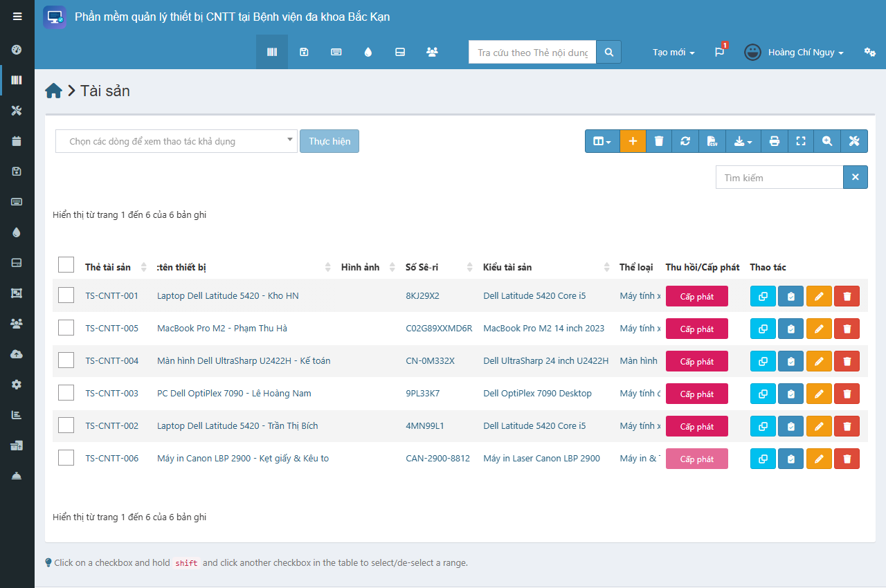

---

### Bước 2.2: Thêm mới một thiết bị khi vừa mua về

- **Khi nào sử dụng**: Khi phòng IT hoặc phòng Hành chính vừa mua thêm máy tính, máy in mới nhập về công ty.
- **Thao tác từng bước**:
  1. Bấm nút **Tạo mới** (màu xanh lá) ở góc trên bên phải trang Tài sản, hoặc truy cập menu **Tài sản -> Tạo mới**.
  2. Điền các thông tin quan trọng:
     - **Thẻ tài sản (Asset Tag)** *(Bắt buộc)*: Mã số quản lý nội bộ dán lên máy (Ví dụ: `TS-CNTT-007`). Nếu để trống, hệ thống sẽ tự sinh số nhảy liên tục.
     - **Tên tài sản**: Đặt tên gợi nhớ (Ví dụ: `Laptop Dell Latitude 5420 - Máy mới kho HN`).
     - **Mẫu mã (Model)** *(Bắt buộc)*: Bấm chọn dòng máy tương ứng (Ví dụ: `Dell Latitude 5420 Core i5`).
     - **Trạng thái** *(Bắt buộc)*: Chọn `Sẵn sàng cấp phát` (nếu máy tốt cất kho) hoặc `Đang chờ cài đặt` (nếu IT đang cài Windows/phần mềm).
     - **Số sê-ri (Serial Number)**: Dãy số sê-ri in ở mặt đáy máy tính hoặc trên vỏ hộp (rất quan trọng để tra cứu bảo hành hãng).
     - **Ngày mua & Giá mua**: Nhập ngày hóa đơn và số tiền mua máy (để tự động tính khấu hao).
  3. Cuộn xuống cuối trang và nhấn nút **Lưu lại** (nút màu xanh dương).

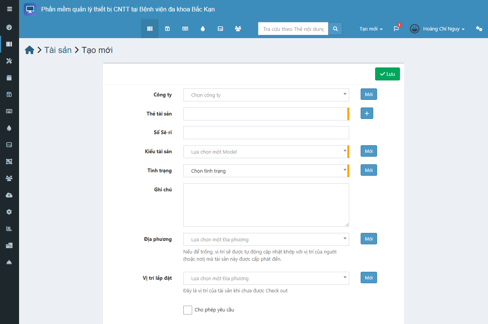

---

### Bước 2.3: Cấp phát thiết bị (Bàn giao cho nhân viên)

- **Khi nào sử dụng**: Khi có nhân viên mới nhận việc, hoặc nhân viên cũ cần cấp thêm màn hình, máy in.
- **Thao tác từng bước**:
  1. Tại danh sách tài sản, tìm thiết bị đang ở trạng thái *Sẵn sàng cấp phát*.
  2. Nhấp vào nút **Cấp phát (Check-out)** ở cột Thao tác bên phải máy đó (biểu tượng mũi tên ra ngoài).
  3. Trong giao diện Cấp phát:
     - **Cấp phát tới**: Mặc định chọn `Người dùng` (hoặc có thể chọn chuyển cho `Vị trí/Phòng ban`).
     - **Người dùng**: Nhấp vào ô và gõ tên nhân viên cần nhận máy (Ví dụ: `Trần Thị Bích`).
     - **Ngày cấp phát**: Mặc định là ngày hôm nay.
     - **Ghi chú**: Điền tình trạng máy lúc giao (Ví dụ: *Máy mới 100%, kèm sạc zin và chuột*).
  4. Nhấn nút xanh **Cấp phát**. Thiết bị sẽ ngay lập tức được ghi nhận vào hồ sơ của nhân viên đó.

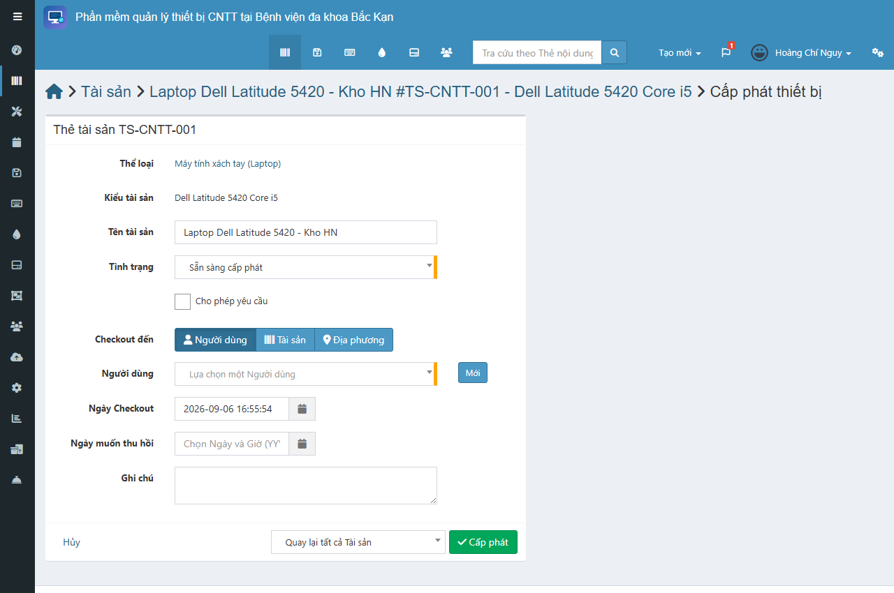

---

### Bước 2.4: Thu hồi thiết bị (Nhận lại máy khi nghỉ việc/đổi máy)

- **Khi nào sử dụng**: Khi nhân viên chuyển công tác, thôi việc hoặc đổi máy khác, mang máy trả lại kho IT.
- **Thao tác từng bước**:
  1. Tìm tài sản cần thu hồi trong danh sách, nhấp vào nút **Thu hồi (Check-in)** màu vàng.
  2. Trong form thu hồi:
     - **Trạng thái sau thu hồi**:
       - Chọn `Sẵn sàng cấp phát`: Nếu máy hoạt động hoàn toàn bình thường, lau chùi sạch sẽ cất lại vào kho.
       - Chọn `Đang chờ xử lý / Cài đặt`: Nếu cần IT cài lại Win và xóa dữ liệu cũ của nhân viên trước.
       - Chọn `Đang sửa chữa / Bảo hành`: Nếu máy bị rơi vỡ, hỏng phím cần đưa đi viện sửa.
     - **Ghi chú thu hồi**: Ghi rõ hiện trạng (Ví dụ: *Đã nhận lại đủ máy và sạc, máy xước nhẹ nắp lưng*).
  3. Bấm nút **Thu hồi**. Tài sản sẽ rời khỏi tên người dùng và quay trở lại kho lưu trữ.

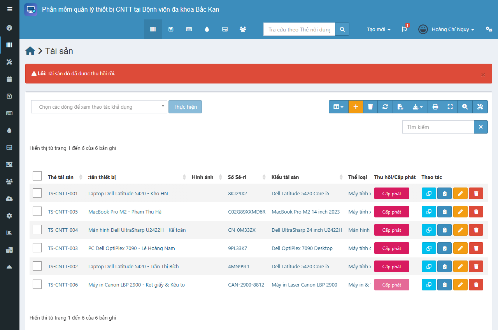

---

### Bước 2.5: Xem lý lịch & lịch sử sử dụng của thiết bị

- **Mục đích**: Xem chiếc máy tính này từ khi mua về đến nay đã qua tay những ai sử dụng, từng sửa chữa những gì, có bị ai làm hỏng không.
- **Thao tác**:
  - Nhấp chuột trực tiếp vào **Tên tài sản** hoặc **Mã tài sản** trong danh sách.
  - Giao diện chi tiết hiện ra gồm các tab:
    - **Thông tin chi tiết**: Cấu hình máy, số sê-ri, giá tiền, ngày mua.
    - **Lịch sử (History)**: Nhật ký đầy đủ ghi rõ: Ai bàn giao cho ai, ngày giờ nào, trả máy ngày nào.
    - **Linh kiện & Phụ kiện kèm theo**: Các thanh RAM, ổ cứng SSD hay chuột đang gắn kèm máy này.

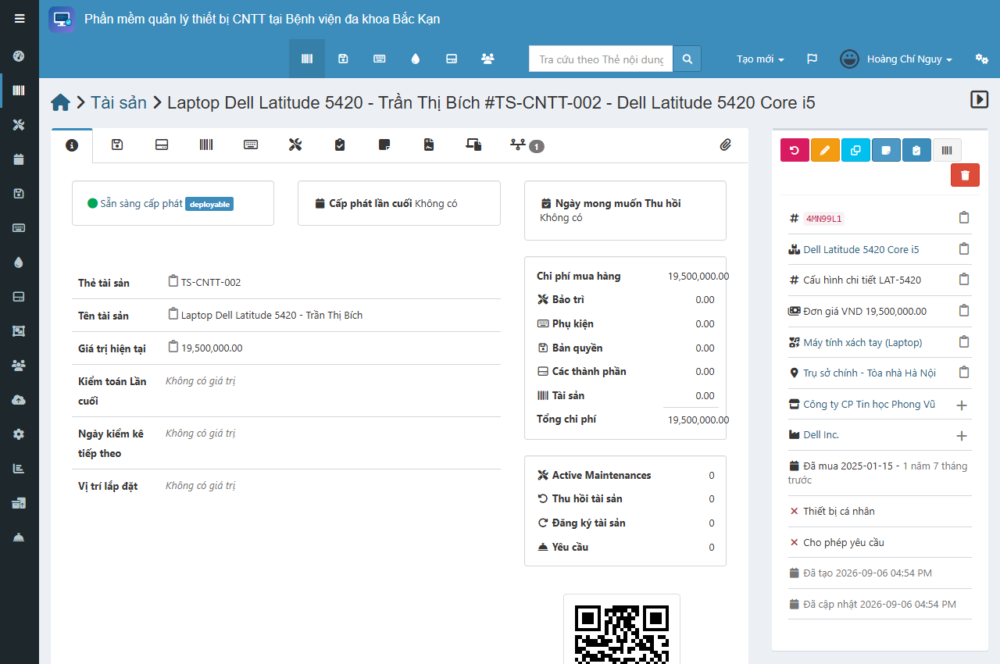

---

### Bước 2.6: In nhãn dán mã vạch / QR Code lên thân máy

- **Mục đích**: In tem nhãn mã vạch/mã QR để dán lên vỏ máy tính, giúp thủ kho dùng máy quét hoặc camera điện thoại quét một phát là ra ngay thông tin máy.
- **Thao tác**:
  1. Tại trang chi tiết tài sản, bấm nút **In nhãn** (biểu tượng máy in hoặc mã vạch) trên thanh công cụ.
  2. Hệ thống sẽ kết xuất tem nhãn có sẵn Tên máy, Mã tài sản, Số sê-ri và Mã QR Code chuẩn 2D.
  3. Bấm `Ctrl + P` trên bàn phím để in ra máy in tem dán (decal) và dán trực tiếp lên thân thiết bị.

---

# PHẦN 3: QUẢN LÝ BẢN QUYỀN PHẦN MỀM (LICENSES)

*(Áp dụng cho: Microsoft Windows, Office 365, AutoCAD, Adobe Photoshop, Phần mềm Kế toán, Antivirus...)*

### Bước 3.1: Xem danh mục bản quyền phần mềm

- **Mục đích**: Biết công ty đã mua những phần mềm nào, đã dùng hết bao nhiêu suất (Seats), còn trống bao nhiêu suất để cấp cho người mới.
- **Thao tác**:
  1. Trên menu bên trái, nhấp chọn **Giấy phép (Licenses)**.
  2. Bảng quản lý hiển thị rõ:
     - **Tên phần mềm**: Ví dụ *Microsoft 365 Business Standard*.
     - **Tổng số giấy phép (Seats)**: Ví dụ 10 suất.
     - **Đã cấp phát**: Ví dụ 2 suất.
     - **Còn lại**: 8 suất khả dụng.
     - **Ngày hết hạn**: Giúp người quản lý biết trước để làm đề xuất gia hạn bản quyền kịp thời.

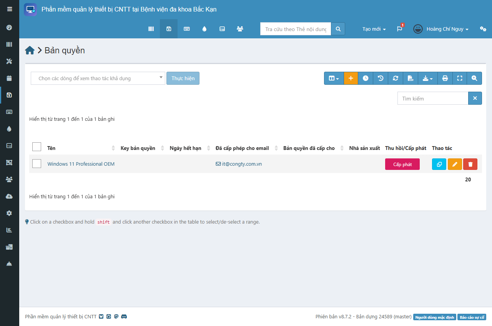

---

### Bước 3.2: Khai báo gói bản quyền phần mềm mới

- **Khi nào sử dụng**: Khi công ty vừa mua thêm key bản quyền phần mềm từ nhà cung cấp.
- **Thao tác từng bước**:
  1. Bấm nút **Tạo mới** trong trang Giấy phép.
  2. Nhập các mục:
     - **Tên phần mềm**: Ví dụ `Microsoft 365 Business Standard`.
     - **Loại danh mục**: Chọn `Phần mềm Văn phòng`.
     - **Số lượng (Seats)**: Nhập tổng số lượng máy/người được phép kích hoạt (Ví dụ: `10`).
     - **Mã sản phẩm (Product Key)**: Khóa bản quyền gồm các ký tự chữ và số do hãng gửi.
     - **Email được cấp phép**: Email công ty dùng để đăng ký tài khoản phần mềm.
     - **Ngày hết hạn**: Ngày gói bản quyền hết hiệu lực (nếu là bản quyền thuê bao theo năm).
  3. Nhấn nút **Lưu lại**.

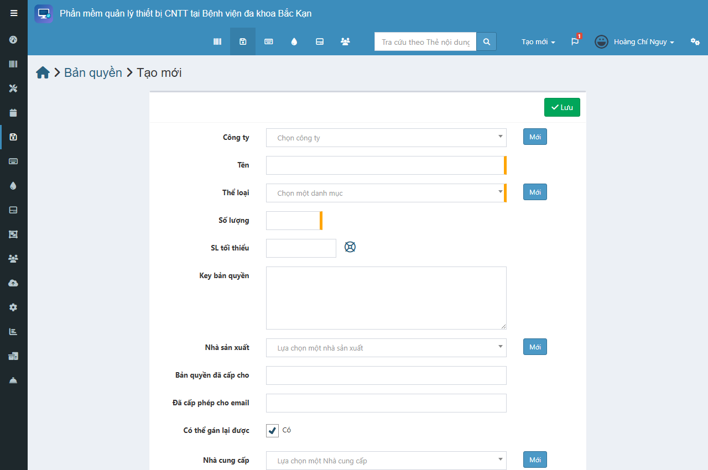

---

### Bước 3.3: Cấp phát bản quyền cho nhân viên

- **Mục đích**: Gán 1 chỗ bản quyền cho nhân viên hoặc máy tính để họ sử dụng hợp pháp.
- **Thao tác**:
  1. Nhấp vào tên gói phần mềm (Ví dụ: *Microsoft 365 Business Standard*).
  2. Danh sách các chỗ ngồi (Seat 1, Seat 2, Seat 3...) sẽ hiện ra.
  3. Tìm một chỗ trống ghi chữ *Sẵn sàng*, bấm nút **Cấp phát (Check-out)**.
  4. Chọn nhân viên nhận (Ví dụ: `Trần Thị Bích`) hoặc chọn máy tính cụ thể.
  5. Bấm **Lưu**. Chỗ ngồi đó sẽ chuyển sang trạng thái đã kích hoạt cho nhân viên được chọn.

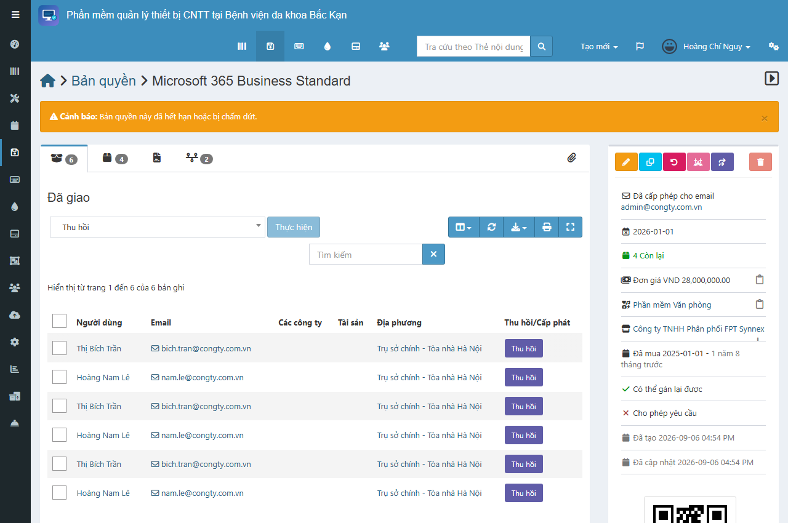

---

# PHẦN 4: QUẢN LÝ PHỤ KIỆN (ACCESSORIES)

*(Áp dụng cho: Chuột máy tính, Bàn phím rời, Tai nghe, Dây cáp HDMI, Cục sạc laptop, Hub chuyển đổi USB-C...)*

### Bước 4.1: Xem danh mục phụ kiện và tồn kho

- **Mục đích**: Quản lý số lượng phụ kiện hiện có trong kho, biết đã phát cho những ai và còn bao nhiêu cái dự phòng.
- **Thao tác**:
  1. Nhấp vào mục **Phụ kiện** trên menu bên trái.
  2. Cột **Số lượng** thể hiện tổng số phụ kiện đã nhập.
  3. Cột **Khả dụng** thể hiện số cái còn nằm trong kho có thể phát ngay.

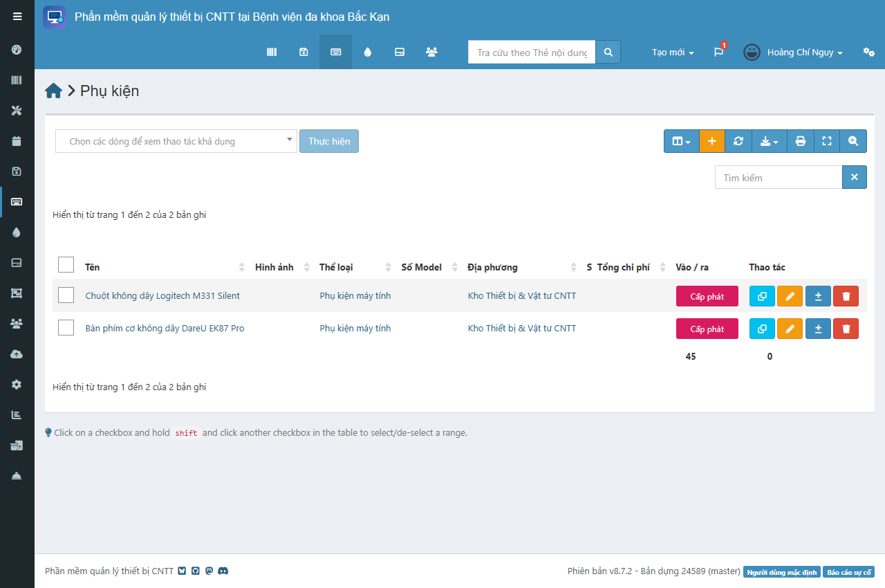

---

### Bước 4.2: Thêm mới phụ kiện vào kho

- **Thao tác**:
  1. Bấm nút **Tạo mới** tại trang Phụ kiện.
  2. Nhập các thông tin:
     - **Tên phụ kiện**: Ví dụ `Chuột không dây Logitech M331 Silent`.
     - **Loại danh mục**: Chọn `Phụ kiện máy tính`.
     - **Số lượng nhập**: Ví dụ `30`.
     - **Số lượng tối thiểu cảnh báo**: Ví dụ `5` (khi kho chỉ còn dưới 5 con chuột, hệ thống sẽ đổi màu cảnh báo để thủ kho đi mua thêm).
  3. Nhấn nút **Lưu lại**.

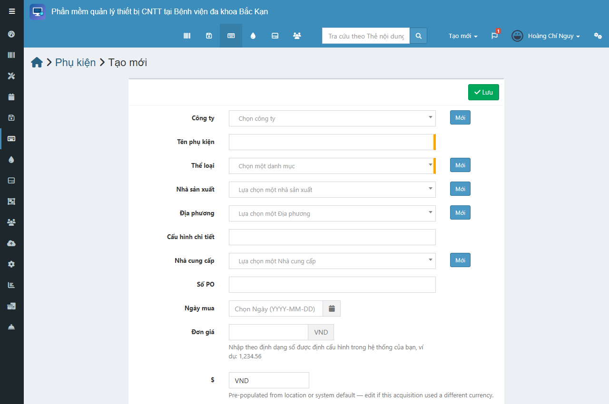

---

### Bước 4.3: Cấp phát phụ kiện cho nhân viên

- **Thao tác**:
  1. Bấm nút **Cấp phát (Check-out)** cạnh phụ kiện cần giao.
  2. Chọn tên nhân viên nhận phụ kiện (Ví dụ: `Lê Hoàng Nam`).
  3. Ghi chú nếu cần và bấm **Cấp phát**.
  4. Số lượng khả dụng trong kho sẽ tự động giảm đi 1 cái. Khi nhân viên nghỉ việc, ta có thể bấm nút **Thu hồi** để lấy lại phụ kiện về kho.

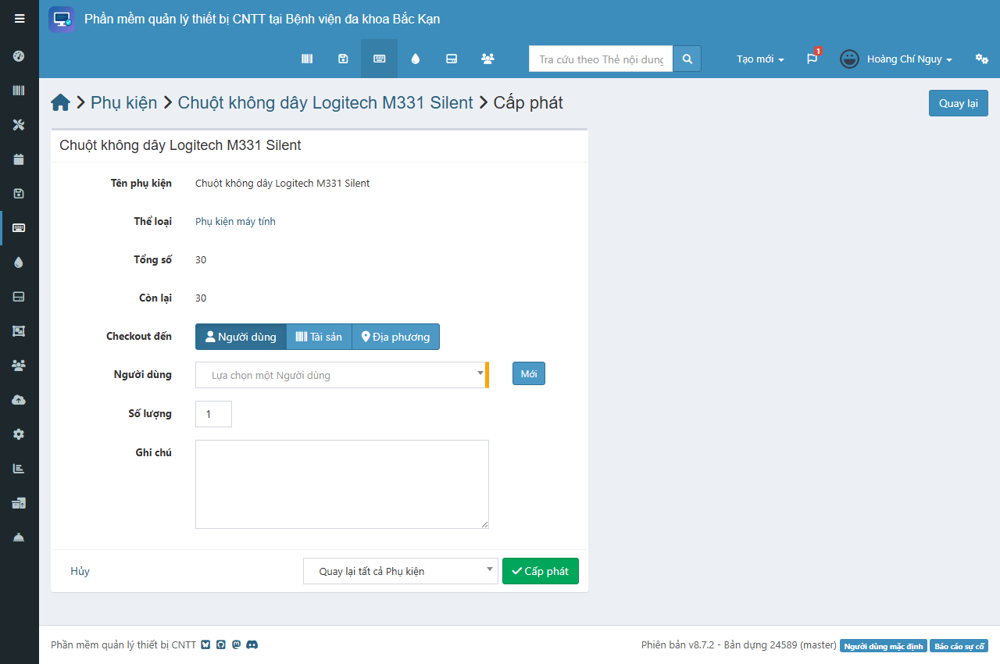

---

# PHẦN 5: QUẢN LÝ VẬT TƯ TIÊU HAO (CONSUMABLES)

*(Áp dụng cho: Hộp mực máy in, Giấy in A4, Đầu bấm hạt mạng RJ45, Pin tiểu, Băng dính, Dây rút nhựa...)*

### Bước 5.1: Theo dõi tồn kho vật tư tiêu hao

- **Đặc thù quan trọng cần nhớ**: Vật tư tiêu hao là những món **dùng là hết, không thu hồi**. Khi cấp phát cho nhân viên là xuất thẳng ra khỏi kho, không có nút Check-in (thu hồi) như máy tính hay phụ kiện.
- **Thao tác xem**:
  - Nhấp vào mục **Vật tư tiêu hao** trên menu.
  - Kiểm tra cột **Số lượng còn lại**. Nếu số lượng xuống thấp hơn định mức tối thiểu, hệ thống sẽ báo đỏ để nhắc nhở phòng mua hàng.

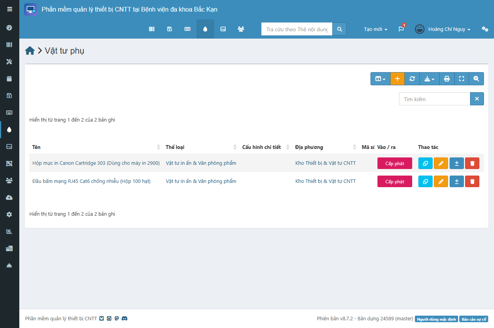

---

### Bước 5.2: Khai báo nhập thêm vật tư tiêu hao

- **Thao tác**:
  1. Bấm nút **Tạo mới** tại trang Vật tư tiêu hao.
  2. Nhập:
     - **Tên vật tư**: Ví dụ `Hộp mực in Canon Cartridge 303 (Dùng cho máy in 2900)`.
     - **Danh mục**: `Vật tư in ấn & Văn phòng phẩm`.
     - **Số lượng**: Ví dụ `12 hộp`.
     - **Số lượng tối thiểu**: Ví dụ `3 hộp` (còn dưới 3 hộp là phải mua gấp).
  3. Bấm **Lưu lại**.

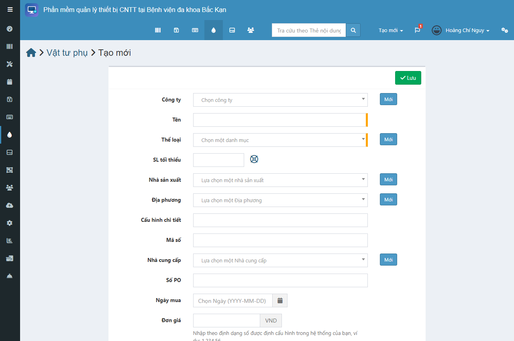

---

### Bước 5.3: Xuất kho vật tư cho nhân viên / phòng ban

- **Thao tác**:
  1. Bấm nút **Cấp phát / Xuất kho (Check-out)** tại dòng vật tư cần xuất.
  2. Chọn người nhận hoặc phòng ban nhận (Ví dụ xuất 1 hộp mực cho chị `Trần Thị Bích` - Phòng Kế toán).
  3. Bấm **Lưu**. Kho sẽ tự động trừ đi 1 hộp và lưu vết lại lịch sử xuất kho để phục vụ kiểm toán nội bộ.

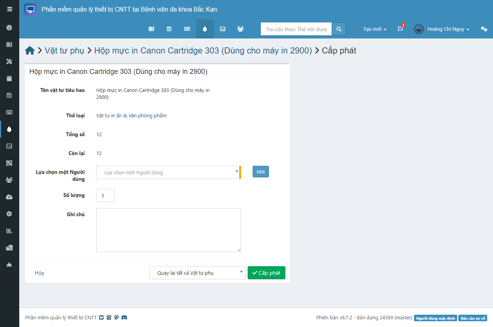

---

# PHẦN 6: QUẢN LÝ LINH KIỆN NÂNG CẤP (COMPONENTS)

*(Áp dụng cho: Thanh RAM, Ổ cứng SSD/HDD, Card màn hình VGA, Card mạng Wi-Fi...)*

### Bước 6.1: Xem danh sách linh kiện trong kho

- **Đặc thù**: Linh kiện là bộ phận gắn **bên trong** máy tính. Vì vậy linh kiện không cấp phát trực tiếp cho người dùng, mà sẽ cấp phát (gắn) vào **một chiếc máy tính cụ thể (Asset)**.
- **Thao tác**: Nhấp vào mục **Linh kiện** trên menu để xem số lượng RAM, ổ cứng đang tồn trong tủ kỹ thuật.

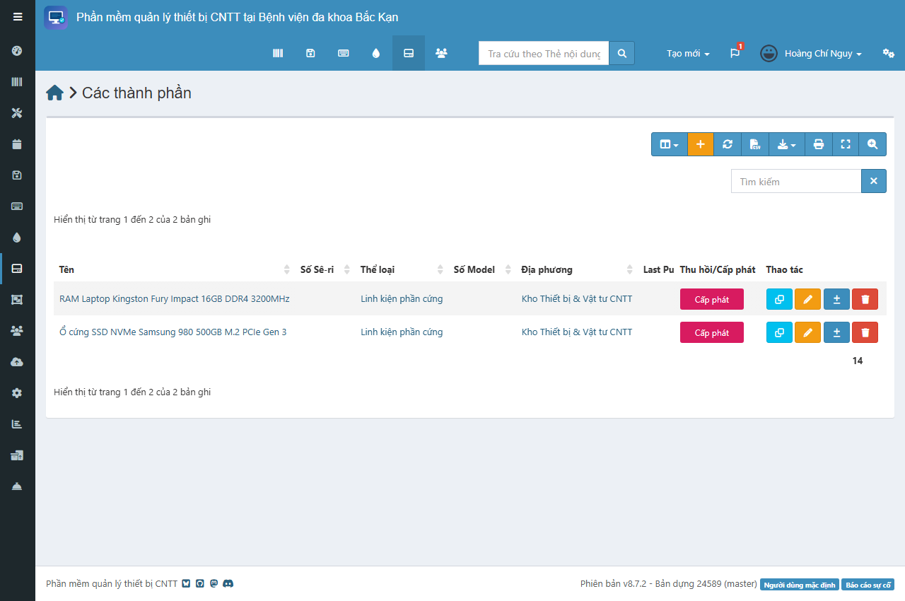

---

### Bước 6.2: Khai báo linh kiện mới

- **Thao tác**:
  1. Bấm **Tạo mới** ở trang Linh kiện.
  2. Nhập tên: Ví dụ `RAM Laptop Kingston Fury 16GB DDR4 3200MHz`.
  3. Nhập số lượng nhập về tủ: Ví dụ `8 thanh`.
  4. Bấm **Lưu lại**.

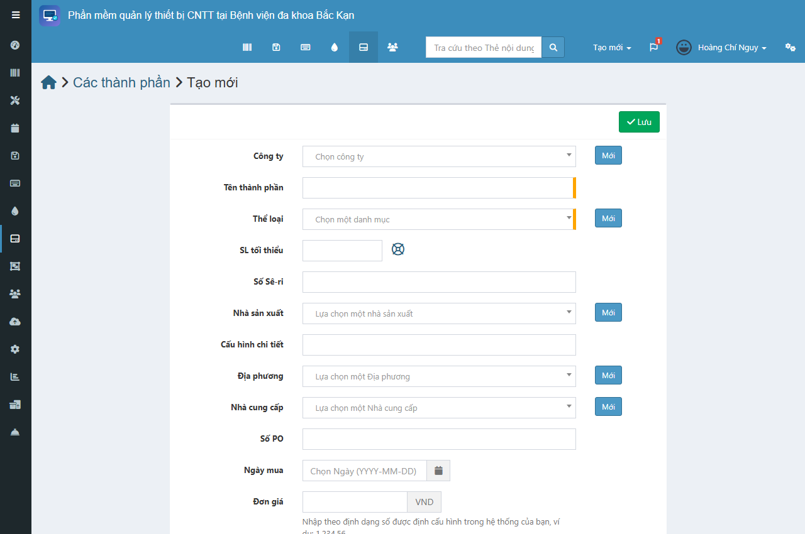

---

### Bước 6.3: Lắp ráp / Gán linh kiện vào một máy tính cụ thể

- **Khi nào sử dụng**: Khi nhân viên phàn nàn máy chạy chậm, IT tháo máy ra và cắm thêm 1 thanh RAM 16GB vào chiếc laptop đó.
- **Thao tác từng bước**:
  1. Tại dòng linh kiện RAM, bấm nút **Cấp phát (Check-out)**.
  2. Ở ô **Tài sản (Asset)**: Gõ chọn chiếc máy tính được nhận thanh RAM này (Ví dụ: chọn máy `Laptop Dell Latitude 5420 - TS-CNTT-002`).
  3. Nhập số lượng gắn: `1 thanh`.
  4. Bấm **Cấp phát**. Giờ đây, khi mở hồ sơ của chiếc laptop Dell kia ra, hệ thống sẽ hiển thị rõ ràng bên trong máy đang có thanh RAM 16GB Kingston này!

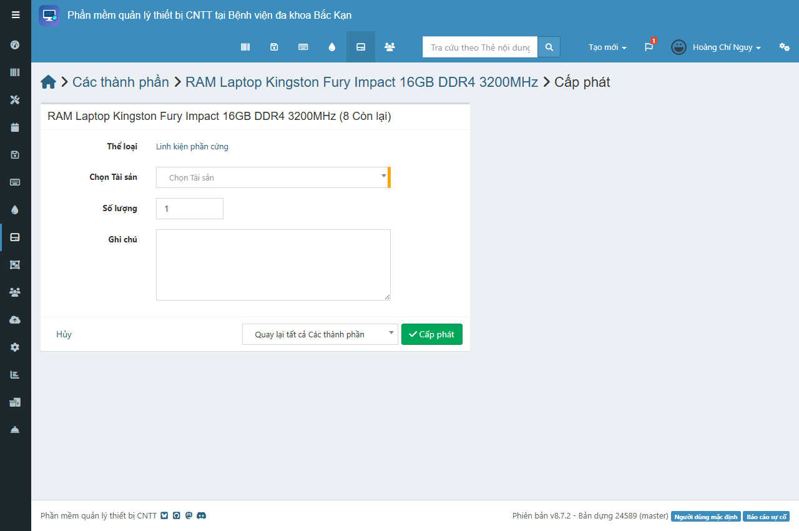

---

# PHẦN 7: GÓI THIẾT BỊ MẪU / COMBO NHÂN VIÊN MỚI (PREDEFINED KITS)

### Bước 7.1: Xem danh sách gói thiết bị mẫu

- **Mục đích**: Thay vì mỗi khi có nhân viên mới, người quản trị phải thao tác 4 lần (cấp laptop, cấp chuột, cấp balo, cấp Office), hệ thống cho phép gom sẵn thành 1 gói Combo tiêu chuẩn.
- **Thao tác**: Nhấp vào mục **Gói thiết bị mẫu (Predefined Kits)** trên menu để xem các gói hiện có.

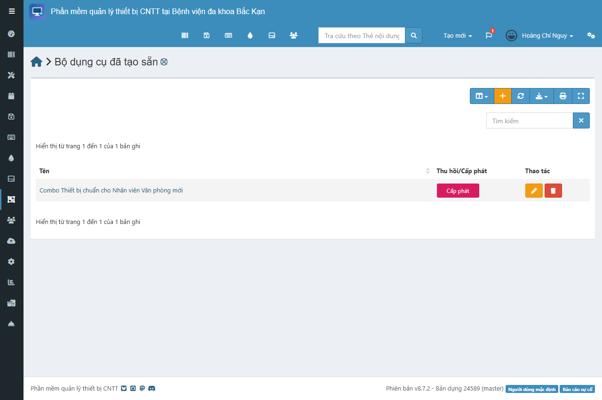

---

### Bước 7.2: Cấp phát 1 chạm cả gói combo cho nhân viên mới

- **Thao tác**:
  1. Bấm nút **Cấp phát (Check-out)** cạnh gói combo (Ví dụ: `Combo Thiết bị chuẩn cho Nhân viên Văn phòng mới`).
  2. Chọn tên nhân viên mới vào làm việc.
  3. Bấm **Xác nhận cấp phát**. Hệ thống sẽ tự động trừ đồng loạt 1 Laptop, 1 Chuột và kích hoạt 1 bản quyền Office cho nhân viên đó chỉ trong đúng 1 cú nhấp chuột!

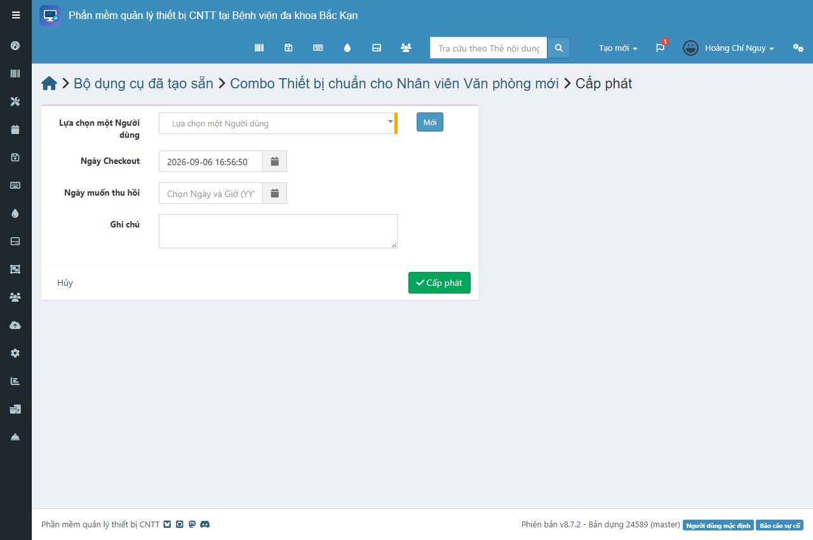

---

# PHẦN 8: THEO DÕI BẢO TRÌ & SỬA CHỮA (MAINTENANCES)

### Bước 8.1: Xem sổ theo dõi sửa chữa và bảo hành

- **Mục đích**: Nắm được hiện tại công ty đang có những thiết bị nào bị hỏng, đang gửi đi sửa ở đâu, dự kiến ngày nào lấy về và chi phí hết bao nhiêu tiền.
- **Thao tác**: Nhấp vào mục **Bảo trì tài sản** (nằm trong phần Tài sản hoặc menu Bảo trì).

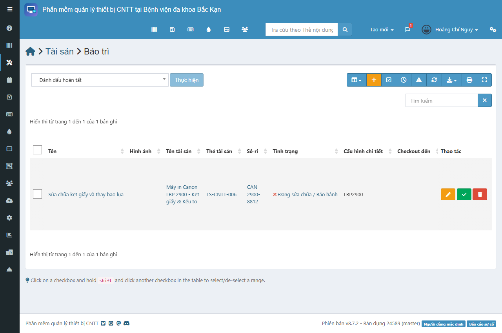

---

### Bước 8.2: Lập phiếu báo hỏng / gửi bảo trì thiết bị

- **Khi nào sử dụng**: Khi máy in bị kẹt giấy rách bao lụa, màn hình laptop bị sọc, bàn phím bị liệt nước vào...
- **Thao tác từng bước**:
  1. Bấm nút **Tạo mới phiếu bảo trì**.
  2. Điền các mục:
     - **Tài sản**: Chọn thiết bị bị hỏng (Ví dụ: `Máy in Canon LBP 2900 - TS-CNTT-006`).
     - **Loại hình**: Chọn `Sửa chữa (Repair)`, `Bảo dưỡng (Maintenance)` hoặc `Bảo hành (Warranty)`.
     - **Nhà cung cấp / Đơn vị sửa chữa**: Chọn bên sửa (Ví dụ: `Công ty Tin học Phong Vũ`).
     - **Tiêu đề & Ghi chú sự cố**: Ghi rõ nguyên nhân (Ví dụ: *Kẹt giấy, rách bao lụa cụm sấy do rơi kẹp ghim vào*).
     - **Ngày bắt đầu gửi sửa & Chi phí dự kiến**: Nhập ngày gửi và số tiền sửa chữa.
  3. Bấm **Lưu lại**. Trạng thái của thiết bị sẽ tự động chuyển sang `Đang sửa chữa / Bảo hành` để không ai vô tình đem đi cấp phát cho người khác.

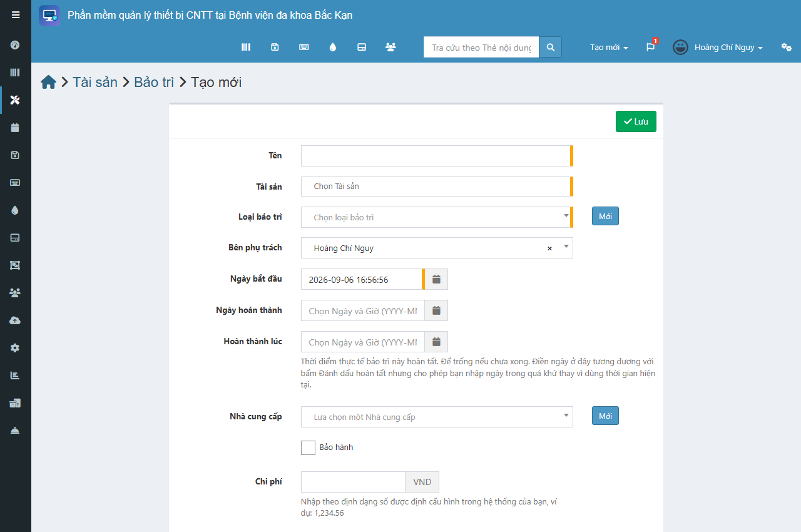

---

# PHẦN 9: QUẢN LÝ NHÂN VIÊN / NGƯỜI DÙNG (USERS)

### Bước 9.1: Tra cứu danh sách nhân viên

- **Mục đích**: Xem danh sách toàn bộ cán bộ nhân viên trong công ty, họ thuộc phòng ban nào, đang giữ bao nhiêu thiết bị và bản quyền phần mềm.
- **Thao tác**: Nhấp chọn **Người dùng (Users)** trên menu bên trái.

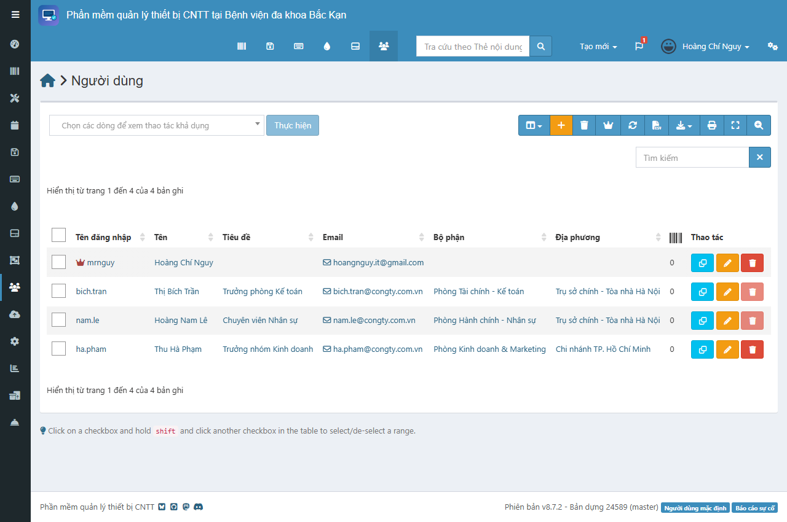

---

### Bước 9.2: Tạo hồ sơ nhân viên mới

- **Khi nào sử dụng**: Khi phòng Nhân sự tiếp nhận nhân sự mới vào làm việc tại công ty.
- **Thao tác**:
  1. Bấm **Tạo mới** trong trang Người dùng.
  2. Điền các thông tin:
     - **Họ & Tên**: Nhập Họ (Ví dụ: `Trần`), Tên (Ví dụ: `Thị Bích`).
     - **Tên đăng nhập (Username)**: Viết liền không dấu (Ví dụ: `bich.tran`).
     - **Email**: Email công việc của nhân viên (Ví dụ: `bich.tran@congty.com.vn`).
     - **Phòng ban**: Bấm chọn phòng (Ví dụ: `Phòng Tài chính - Kế toán`).
     - **Vị trí / Nơi làm việc**: Chọn chi nhánh (Ví dụ: `Trụ sở chính - Tòa nhà Hà Nội`).
     - **Chức danh**: Nhập chức vụ (Ví dụ: `Trưởng phòng Kế toán`).
  3. Bấm **Lưu lại**.

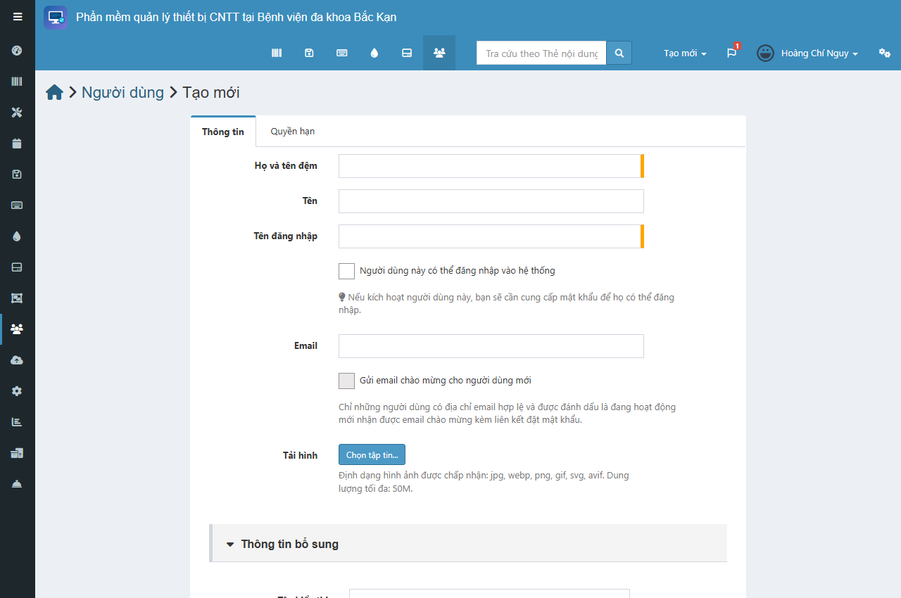

---

### Bước 9.3: Xem toàn bộ tài sản nhân viên đang nắm giữ

- **Khi nào sử dụng (CỰC KỲ QUAN TRỌNG)**: Khi một nhân viên **chuẩn bị nghỉ việc** hoặc **chuyển phòng ban**. Thủ kho và Nhân sự cần vào đây để đối soát xem nhân viên đó đang cầm những món đồ gì của công ty để thu hồi triệt để trước khi ký giấy xác nhận nghỉ việc.
- **Thao tác**:
  1. Bấm vào tên nhân viên trong danh sách (Ví dụ: Bấm vào chị `Trần Thị Bích`).
  2. Màn hình hồ sơ sẽ hiển thị rõ từng thẻ:
     - **Tài sản (Assets)**: Đang giữ 01 Laptop Dell Latitude và 01 Màn hình Dell UltraSharp.
     - **Giấy phép (Licenses)**: Đang dùng 01 suất bản quyền Microsoft 365.
     - **Phụ kiện (Accessories)**: Đang giữ 01 Chuột không dây Logitech.
  3. Tại từng dòng, bạn chỉ cần bấm nút **Thu hồi (Check-in)** là hoàn tất nhận lại tài sản sạch sẽ!

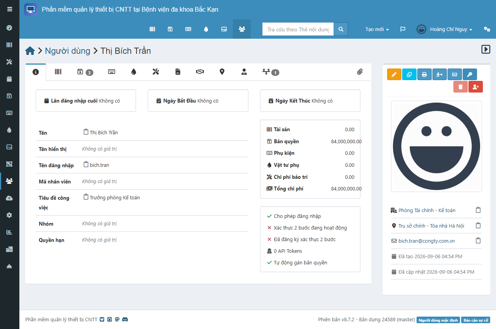

---

# PHẦN 10: THIẾT LẬP DANH MỤC NỀN TẢNG (CATEGORIES, LOCATIONS, STATUS)

### Bước 10.1: Quản lý Loại tài sản (Categories)

- **Mục đích**: Phân loại tài sản vào từng nhóm chuẩn hóa (Laptop, Máy bàn, Màn hình, Máy in...) để dễ thống kê, lọc và tính khấu hao.
- **Thao tác**: Nhấp vào menu **Cài đặt -> Danh mục (Categories)**.

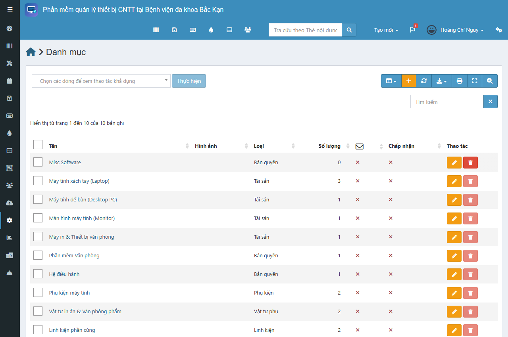

---

### Bước 10.2: Quản lý Vị trí / Chi nhánh (Locations) & Phòng ban

- **Mục đích**: Khai báo các tòa nhà, văn phòng, kho bãi hoặc chi nhánh các tỉnh (Hà Nội, TP.HCM, Đà Nẵng) để khi cấp phát máy móc, bạn biết chính xác thiết bị đó đang đặt ở tầng nào, phòng nào.
- **Thao tác**: Nhấp vào menu **Cài đặt -> Địa điểm (Locations)** hoặc **Phòng ban (Departments)**.

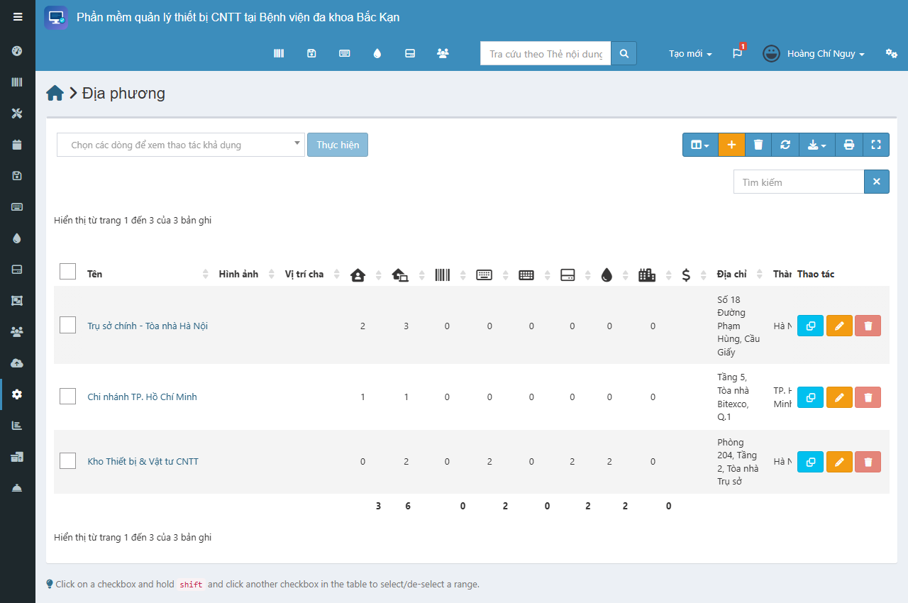

---

# PHẦN 11: BÁO CÁO, KHẤU HAO & NHẬT KÝ HOẠT ĐỘNG (REPORTS)

### Bước 11.1: Báo cáo khấu hao giá trị tài sản

- **Mục đích**: Cung cấp số liệu chính xác cho phòng Kế toán và Ban Giám đốc biết toàn bộ máy tính của công ty qua thời gian sử dụng hiện còn lại giá trị bao nhiêu tiền, máy nào đã hết hạn khấu hao.
- **Thao tác**:
  1. Trên menu bên trái, nhấp vào mục **Báo cáo** -> chọn **Báo cáo khấu hao**.
  2. Bảng báo cáo tính toán tự động:
     - **Giá mua ban đầu**.
     - **Khấu hao lũy kế** (đã hao mòn bao nhiêu tiền).
     - **Giá trị sổ sách còn lại (Current Value)**.
  3. Bạn có thể nhấn nút **Xuất file (Export)** sang định dạng Microsoft Excel hoặc CSV để gửi báo cáo tài chính.

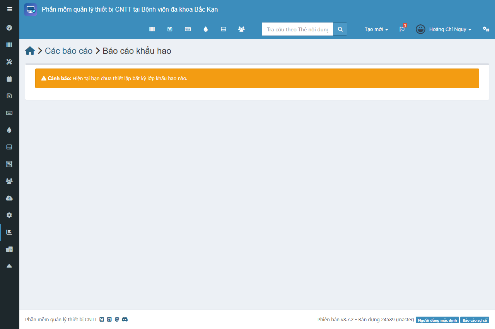

---

### Bước 11.2: Xem Nhật ký hoạt động (Ai làm gì, vào lúc nào)

- **Mục đích**: Minh bạch hóa 100% mọi hành động trong hệ thống. Tránh tình trạng tranh cãi *"Tôi không bàn giao máy đó"*, *"Ai đã xóa thông tin máy này?"*.
- **Thao tác**:
  1. Nhấp vào mục **Báo cáo** -> chọn **Nhật ký hoạt động (Activity Log)**.
  2. Màn hình lưu vết chi tiết từng giây phút:
     - Thời gian chính xác (Ngày, giờ, phút).
     - Người thực hiện (Quản trị viên nào thao tác).
     - Hành động cụ thể: Cấp phát, Thu hồi, Thêm mới, Sửa thông tin, Xóa.
     - Thiết bị và người nhận liên quan.

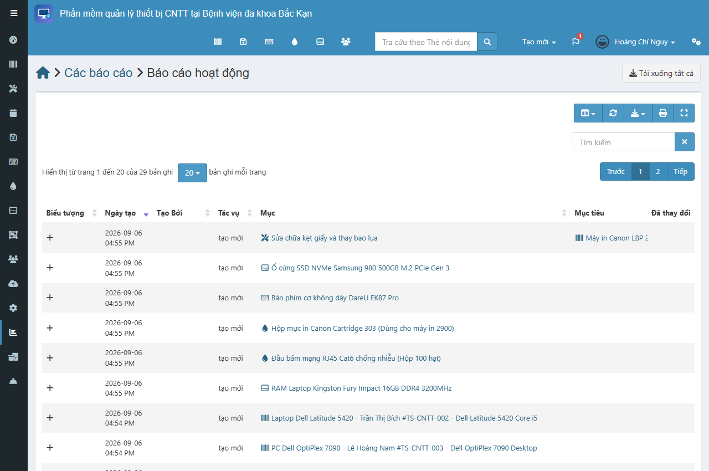

---

## TỔNG KẾT QUY TRÌNH CHUẨN DÀNH CHO CÁN BỘ QUẢN LÝ TÀI SẢN

Để quản lý thiết bị luôn chuẩn chỉ và không bị thất thoát, hãy luôn tuân thủ **Quy tắc 3 KHÔNG - 3 PHẢI**:

1. **PHẢI dán tem mã tài sản (Asset Tag)** ngay khi bóc hộp thiết bị mới mua về.
2. **PHẢI bấm "Cấp phát (Check-out)" trên phần mềm** TRƯỚC KHI trao máy vào tay nhân viên.
3. **PHẢI bấm "Thu hồi (Check-in)" trên phần mềm** NGAY KHI nhận lại máy từ nhân viên nghỉ việc.
4. **KHÔNG cho mượn máy truyền tay nhau** giữa các nhân viên mà không báo cho quản lý tài sản cập nhật hệ thống.
5. **KHÔNG tự ý vứt bỏ máy hỏng** mà chưa đổi trạng thái sang "Đã thanh lý".
6. **KHÔNG để tồn kho vật tư tiêu hao xuống dưới mức tối thiểu** rồi mới đặt hàng.

*Chúc anh/chị quản lý tài sản và thiết bị công nghệ thông tin luôn khoa học, hiệu quả và chính xác!*
