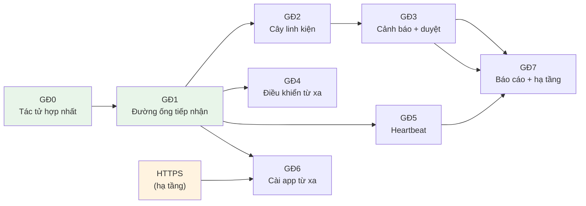

# Tích hợp Tác tử QLTS vào Snipe-IT — KẾ HOẠCH TỔNG THỂ

> **Đây là kế hoạch lộ trình, KHÔNG phải kế hoạch thực thi.**
> Mỗi giai đoạn có kế hoạch thực thi riêng trong cùng thư mục này, viết theo skill `superpowers:writing-plans` khi tới lượt.

**Mục tiêu:** Biến Snipe-IT v8.7.2 thành hệ thống quản lý thiết bị CNTT duy nhất — tự kiểm kê, cảnh báo thay linh kiện, điều khiển từ xa, cài app từ xa, báo cáo — cho trên 300 máy trạm.

**Spec:** [`docs/superpowers/specs/2026-09-30-tich-hop-tac-tu-qlts-design.md`](../specs/2026-09-30-tich-hop-tac-tu-qlts-design.md)

**Nền tảng:** Snipe-IT v8.7.2 · Laravel 12 · Livewire 4 · PHP 8.2 · MySQL · GLPI Agent 1.20 · RustDesk 1.4.9 · Inno Setup

---

## Ràng buộc toàn dự án

Mọi giai đoạn đều phải tuân thủ. Sao nguyên văn từ spec:

| # | Ràng buộc |
|---|---|
| RB-1 | **Không thêm/sửa cột nào trên bảng lõi Snipe-IT.** Mọi bảng mới dùng tiền tố `inv_` |
| RB-2 | **Chỉ được chạm 13 file lõi** đã liệt kê ở spec §13. Chạm file lõi thứ 14 → phải dừng, xin duyệt lại |
| RB-3 | Mọi code mới nằm trong vùng riêng theo spec §14 (`app/*/Inventory/`, `app/Http/Controllers/Agent/`, `routes/agent.php`, ...) |
| RB-4 | **Parser phải so khoá không phân biệt hoa/thường** — giao thức JSON gửi khoá chữ thường, XML gửi chữ hoa (spec §4.2, Cạm bẫy số 1) |
| RB-5 | `uuid` của deploy job phải khớp `/^[0-9a-f-]+$/i` và job phải có đủ 4 khoá `uuid`, `associatedFiles`, `actions`, `checks` (spec §4.5, Cạm bẫy số 2) |
| RB-6 | **`Task::Collect` luôn tắt** trong `agent.cfg`. `tasks = inventory,deploy` |
| RB-7 | GĐ6 (cài app từ xa) **không được bật trước khi HTTPS hoạt động** |
| RB-8 | `AssetMatcher` **không bao giờ** khớp máy theo RustDesk ID |
| RB-9 | Không tự tạo tài sản mới khi agent gửi về máy lạ — ghi `inv_unmatched` |
| RB-10 | Linh kiện tháo ra **không** cộng vào kho `components` |
| RB-11 | Mọi nhãn giao diện phải có cả `resources/lang/vi-VN/` **và** `resources/lang/en-US/` |
| RB-12 | Ngưỡng cấu hình dùng đúng giá trị mặc định ở spec §6.2 (7 ngày / 15 phút / 5 phút / 10% / 60% / 30 ngày / 10 bản / 4 giờ / 24 giờ) |
| RB-13 | Chạy test bằng `tools\php\php.exe vendor\bin\phpunit` (PHP hệ thống có thể khác phiên bản) |

---

## Sơ đồ phụ thuộc



GĐ0 và GĐ1 làm **song song** — GĐ0 ở `D:\DEV\QLTS`, GĐ1 ở `D:\DEV\Quanly-CNTT`, không tranh file nào của nhau. GĐ1 cần GĐ0 xong mới **kiểm chứng end-to-end** được, nhưng code được ngay nhờ `artisan inv:import`.

---

## Bảng lộ trình

| GĐ | Tên | Kế hoạch chi tiết | Cần trước | Cổng kiểm soát để coi là XONG |
|---|---|---|---|---|
| **0** | Tác tử hợp nhất "Trợ lý CNTT" | [`2026-09-30-gd0-tac-tu-hop-nhat.md`](2026-09-30-gd0-tac-tu-hop-nhat.md) | — | Cài lên 1 máy thử: 2 service chạy; Programs & Features **1 dòng**; `rustdesk --get-id` trả ID; gỡ sạch |
| **1** | Đường ống tiếp nhận kiểm kê | [`2026-09-30-gd1-duong-ong-tiep-nhan.md`](2026-09-30-gd1-duong-ong-tiep-nhan.md) | GĐ0 (để kiểm chứng) | Agent thật gửi về → có dòng trong `inv_agents` kèm `rustdesk_id`; agent **chuyển sang giao thức JSON** (xác nhận bằng `--debug`) |
| **2** | Cây linh kiện 100% như GLPI | *viết khi tới lượt* | GĐ1 | Tab **Thông tin kiểm kê** hiện đủ CPU/RAM theo khe/ổ cứng theo serial/phân vùng/card/màn hình/HĐH/phần mềm — đối chiếu khớp GLPI cho cùng máy |
| **3** | Cảnh báo thay linh kiện → duyệt → hỏng hóc | *viết khi tới lượt* | GĐ2 | Đổi 1 thanh RAM → có cảnh báo → duyệt → cây cập nhật + thanh cũ vào **Linh kiện hỏng hóc** + có **phiếu bảo trì**. Từ chối thì cây không đổi. **Khoa phòng:** nhãn `/TAG=` từ bộ cài vào hàng chờ duyệt, duyệt xong mới ghi `assets.location_id`; tạo được khoa phòng mới ngay tại màn hình duyệt; `CHUA-PHAN-NHOM` không sinh khoa phòng mà máy nằm ở **Kho**; thu hồi máy → tự về Kho |
| **4** | Điều khiển từ xa | *viết khi tới lượt* | GĐ1 | Không quyền → 403; có quyền → mở được RustDesk; **mọi lần bấm có dòng nhật ký**; tắt công tắc 2FA thì không bị chặn |
| **5** | Tình trạng máy liên tục | *viết khi tới lượt* | GĐ1 | Đèn xanh khi máy bật, **đỏ sau 15 phút** tắt máy; hiện đúng người đăng nhập/IP/%CPU/RAM/đĩa; dọn được heartbeat cũ |
| **6** | Cài app từ xa | *viết khi tới lượt* | GĐ1 + **HTTPS** | Nạp 1 MSI → gửi tới 1 máy → agent tải, kiểm SHA512, cài xong → tiến độ báo **ok**; app xuất hiện trong `inv_softwares` lần kiểm kê sau |
| **7** | Báo cáo + hạ tầng >300 máy | *viết khi tới lượt* | GĐ2, GĐ3, GĐ5 | **4 báo cáo mới** đúng số liệu, xuất Excel/PDF; **3 báo cáo có sẵn** (Điều chỉnh tài sản, Bản quyền, Nhật ký kiểm kê) hiện thêm cột kiểm kê đúng; **Bảo trì** và **Hoạt động** hiện bản ghi của GĐ3/GĐ4 mà **không sửa code báo cáo**; `inv:doctor` báo đủ **13 file lõi**; chạy nginx/IIS + php-fpm; `queue:work` là Windows Service; mô phỏng 300 agent gửi cùng lúc web vẫn mở |

---

## Quy trình làm việc cho từng giai đoạn

Toàn dự án dùng **Superpowers**. Mỗi giai đoạn đi đúng vòng sau:

```
1. brainstorming  → chốt chi tiết còn mở của giai đoạn đó (nếu có)
2. writing-plans  → viết kế hoạch chi tiết từng bước vào docs/superpowers/plans/
3. using-git-worktrees → tạo nhánh/worktree riêng cho giai đoạn
4. executing-plans hoặc subagent-driven-development → thực thi
5. test-driven-development → mỗi việc: test đỏ trước, code sau
6. requesting-code-review → soát trước khi gộp
7. verification-before-completion → chạy lệnh kiểm chứng, dán kết quả ra, MỚI được nói "xong"
8. finishing-a-development-branch → gộp
```

**Không giai đoạn nào được tuyên bố hoàn thành** khi chưa dán được kết quả của lệnh kiểm chứng ở cột "Cổng kiểm soát" bảng trên.

---

## Sau mỗi lần nâng cấp Snipe-IT

Chạy `tools\php\php.exe artisan inv:doctor` (viết ở GĐ1) — lệnh này kiểm 13 file lõi còn đủ bản vá hay đã bị ghi đè, và in ra đúng chỗ cần chèn lại.

---

## Vì sao GĐ2–GĐ7 chưa có kế hoạch chi tiết

Theo `CLAUDE.md` §2 (*Simplicity First — không làm thứ suy đoán*): khuôn dữ liệu thật mà agent gửi về chỉ biết chắc **sau khi GĐ1 chạy và bắt được bản kiểm kê thật của máy trong đơn vị**. Viết trước 2.000 dòng kế hoạch cho GĐ2–GĐ7 bây giờ là suy đoán, và gần như chắc chắn phải viết lại.

Mỗi giai đoạn sẽ có kế hoạch chi tiết viết ngay trước khi thực thi, dùng **bản kiểm kê thật** làm fixture cho test.
