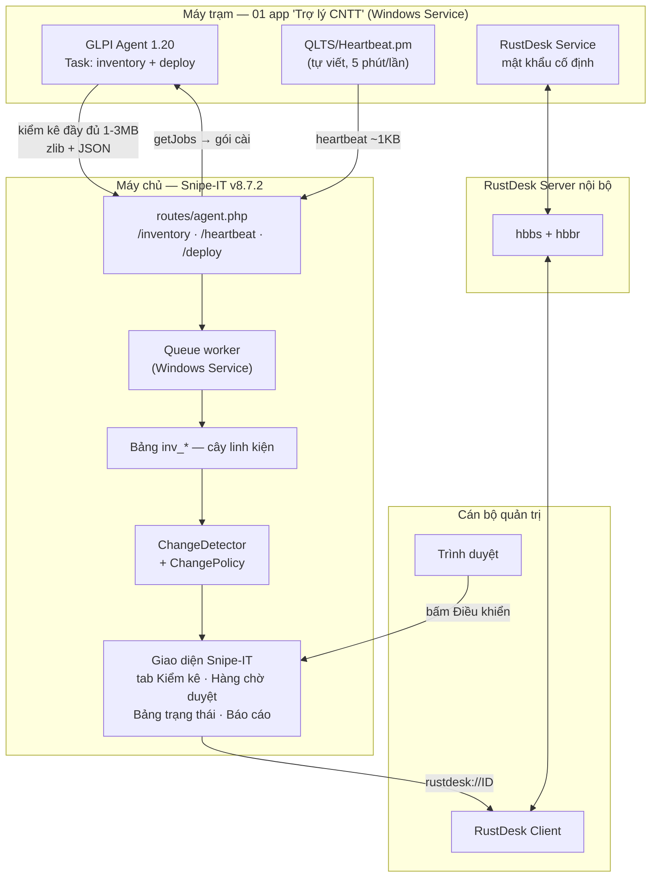
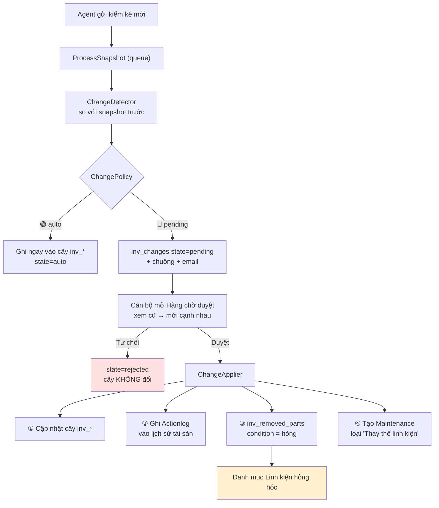
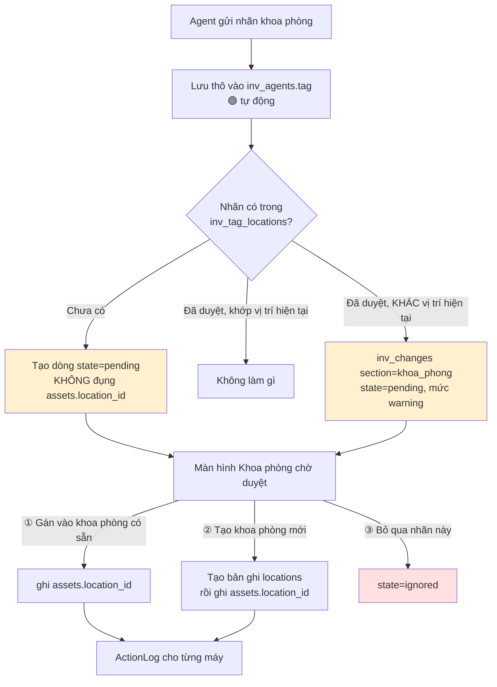

# Thiết kế: Tích hợp Tác tử QLTS vào Snipe-IT

> **Dự án:** Quanly-CNTT (Snipe-IT v8.7.2)
> **Ngày:** 30/09/2026
> **Trạng thái:** Chờ duyệt spec
> **Phạm vi:** Kiểm kê tự động · Cảnh báo thay linh kiện · Điều khiển từ xa · Cài app từ xa · Báo cáo

---

## 1. Tóm tắt điều hành

Biến Snipe-IT thành **hệ thống quản lý thiết bị CNTT duy nhất** của đơn vị, thay thế hoàn toàn vai trò của GLPI:

1. **Tác tử hợp nhất "Trợ lý CNTT"** — 01 bộ cài duy nhất trên máy trạm, gói GLPI Agent 1.20 + RustDesk, chạy như Windows Service.
2. **Kiểm kê tự động** — máy trạm báo cáo cấu hình về Snipe-IT, đầy đủ ngang GLPI (CPU, RAM theo từng khe, ổ cứng theo serial, card, màn hình, HĐH, phần mềm). Bộ cài hỏi **khoa phòng**; nhãn đó lên máy chủ vào hàng chờ để quản trị duyệt thành vị trí chính thức của tài sản.
3. **Cảnh báo thay linh kiện** — phát hiện linh kiện bị thay, đưa vào hàng chờ duyệt; duyệt xong thì cập nhật hồ sơ, ghi linh kiện tháo ra vào danh mục **hỏng hóc**, sinh phiếu bảo trì.
4. **Điều khiển từ xa** — bấm nút trên hồ sơ tài sản để mở phiên RustDesk, có phân quyền và ghi nhật ký.
5. **Cài app từ xa** — đẩy gói cài xuống máy trạm hoặc nhóm máy, theo dõi tiến độ.
6. **Báo cáo** — 4 báo cáo quản trị mới, cộng việc làm giàu 5 báo cáo có sẵn của Snipe-IT bằng dữ liệu kiểm kê. Xuất Excel/PDF.

Quy mô thiết kế: **trên 300 máy trạm**.

---

## 2. Hiện trạng đã khảo sát

### 2.1 Phần mềm quản lý — `D:\DEV\Quanly-CNTT`

| Hạng mục | Thực tế |
|---|---|
| Sản phẩm | Snipe-IT (`grokability/snipe-it`), `config/version.php` → **v8.7.2** build 24589 |
| Nền tảng | Laravel 12, Livewire 4, PHP ≥ 8.2, MySQL |
| Việt hoá | `resources/lang/vi-VN/` đầy đủ |
| Cách chạy hiện tại | `start.bat` → MySQL cổng 3307 + `php artisan serve --port=8000` |
| Tích hợp GLPI-Agent | **Chưa có gì.** Không endpoint, không bảng, không cảnh báo |
| Báo cáo hiện có | Chỉ báo cáo tĩnh sẵn của Snipe-IT: `asset`, `activity`, `audit`, `depreciation`, `licenses`, `maintenances`, `accessories`, `unaccepted_assets` |

### 2.2 Nguồn dữ liệu — `D:\DEV\QLTS`

| Hạng mục | Thực tế |
|---|---|
| GLPI | 11.0.9, chạy WSL/Apache tại `localhost:8080`, MariaDB 11.8 |
| GLPI Agent | mã nguồn `glpi-agent/`, bản đóng gói `glpi-agent-bin/`, bộ cài `GLPI-Agent-1.20-x64.zip` |
| Trạng thái agent | `run-agent-inventory.bat` đang trỏ về `http://localhost:8080/front/inventory.php` |

Sau khi hoàn thành, GLPI + WSL + MariaDB **được gỡ bỏ**. `run-agent-inventory.bat` trỏ về Snipe-IT.

### 2.3 Vướng mắc cấu trúc phải ghi rõ

Bảng `components` của Snipe-IT là **kho vật tư theo số lượng**, không phải cây linh kiện theo máy:

- `components`: `qty`, `min_amt`, `category_id` — mô hình tồn kho.
- Bảng trung gian `components_assets` chỉ mang `assigned_qty` — xem [`app/Models/Component.php:208`](../../../app/Models/Component.php#L208).

→ **Không thể** mô tả *"khe RAM số 2 của máy PC-045 đang cắm thanh Samsung 8GB DDR4-3200 serial 4A21C8F"* bằng cấu trúc này. Phải dùng nhóm bảng riêng.

**Tài sản không có khoa phòng riêng:**

- `assets` chỉ có `location_id` và `rtd_location_id` → trỏ sang bảng `locations`. **Không có `department_id`** — xem [`app/Models/Asset.php:193,200`](../../../app/Models/Asset.php#L193).
- Bảng `departments` của Snipe-IT gắn vào **người dùng** (`users.department_id`), không gắn vào tài sản. Muốn lọc tài sản theo phòng ban, Snipe-IT phải đi vòng qua *người đang được cấp phát máy* — xem [`app/Models/Asset.php:2094-2112`](../../../app/Models/Asset.php#L2094).

→ Máy chưa cấp cho ai thì **không thuộc phòng ban nào**, trong khi bệnh viện vẫn cần biết nó đặt ở khoa nào. **QĐ-10:** khoa phòng của máy ánh xạ vào `locations`, không động vào `departments` và **không thêm cột vào bảng `assets`** (sửa schema lõi sẽ xung đột mỗi lần nâng cấp). Luồng duyệt: §8.2.

---

## 3. Quyết định kiến trúc (đã chốt với chủ đầu tư)

| # | Quyết định | Lý do |
|---|---|---|
| **QĐ-1** | **Agent gửi thẳng về Snipe-IT.** Viết endpoint tương thích giao thức GLPI-Agent trong Snipe-IT. Bỏ GLPI/WSL | Một hệ thống duy nhất để vận hành; người dùng cuối chỉ học 1 phần mềm |
| **QĐ-2** | **Nhóm bảng riêng `inv_*`**, không sửa bảng lõi Snipe-IT. Giữ `components` cho kho vật tư | Đạt độ sâu ngang GLPI; nâng cấp Snipe-IT sau này không vỡ |
| **QĐ-3** | **GLPI Agent làm thân** của tác tử hợp nhất, chạy Windows Service. RustDesk do bộ cài chung đặt vào. Gói bằng Inno Setup thành 01 phần mềm | Phần khó nhất (máy trạm, 300+ máy) đã có sẵn và đã được kiểm nghiệm nhiều năm. Chạy SYSTEM nên lỗi `RustDesk.pm` tự hết |
| **QĐ-4** | **Tách đôi xử lý thay đổi**: thông tin không ảnh hưởng giá trị tài sản → tự động ghi; thay đổi linh kiện/serial → hàng chờ duyệt | Phù hợp quy định kiểm kê tài sản công |
| **QĐ-5** | Linh kiện tháo ra → **bản ghi hỏng + phiếu bảo trì**. **Không** cộng vào kho `components` | Linh kiện hỏng không phải vật tư khả dụng |
| **QĐ-6** | Điều khiển từ xa: cho `superuser` **hoặc** `admin` **hoặc** quyền riêng `remote.control` | Theo yêu cầu chủ đầu tư |
| **QĐ-7** | **Tắt `Task::Collect` / `Command`** (chạy lệnh tuỳ ý) | Xem §12.1 — rủi ro không chấp nhận được |
| **QĐ-8** | 2FA cho quyền điều khiển từ xa: **mặc định BẬT, quản trị tắt được** trong Cài đặt | Theo yêu cầu chủ đầu tư |
| **QĐ-9** | Agent check-in **không** cập nhật `last_audit_date` — kiểm kê tài sản vẫn là việc người thật xác nhận tại chỗ (§11.6) | Hồ sơ kiểm kê phải chứng minh được có người nhìn thấy tài sản thật |
| **QĐ-10** | Khoa phòng của máy ánh xạ vào `locations`; **không** dùng `departments`, **không** thêm cột vào `assets` (§2.3) | `assets` không có `department_id`; `departments` gắn vào người dùng nên máy chưa cấp cho ai sẽ không thuộc khoa nào |
| **QĐ-11** | **Không bao giờ tự tạo bản ghi `locations`** từ nhãn agent. Chỉ admin tạo, từ màn hình duyệt (§8.2) | Một lỗi gõ trong bộ cài sẽ sinh khoa phòng rác vĩnh viễn trong danh mục |
| **QĐ-12** | Nhãn `CHUA-PHAN-NHOM` luôn `ignored`, không bao giờ thành khoa phòng (§8.2) | Đó là dấu hiệu người cài quên điền, không phải tên khoa |
| **QĐ-13** | `assets.location_id` chỉ đổi khi có người duyệt, kể cả với nhãn đã duyệt trước đó (§8.2) | Máy đổi nhãn = điều chuyển tài sản giữa khoa phòng, là việc hành chính |

---

## 4. Giao thức GLPI-Agent — sự thật đã kiểm chứng từ mã nguồn

> Toàn bộ mục này **đọc trực tiếp từ `D:\DEV\QLTS\glpi-agent`**, không lấy từ tài liệu.

### 4.1 Tầng vận chuyển

| Đặc điểm | Giá trị | Nguồn |
|---|---|---|
| Phương thức | `POST` tới URL `--server` | `HTTP/Client/GLPI.pm:83` |
| Nén | `Compress::Zlib::compress()` — mặc định | `HTTP/Client.pm:97-101, 693-700` |
| `Content-Type` gửi lên | `application/x-compress-zlib`, hoặc `application/x-compress-gzip`, hoặc bỏ trống khi `--no-compression` | `HTTP/Client.pm:110-113` |
| Header bắt buộc | `GLPI-Agent-ID: <UUID>` — agent tự từ chối gửi nếu không hợp lệ | `HTTP/Client/GLPI.pm:38-48, 58-63` |
| Header tuỳ chọn | `GLPI-Proxy-ID`, `GLPI-Request-ID` (8 ký tự hex, chỉ khi debug) | `HTTP/Client/GLPI.pm:44-48` |
| Máy chủ trả về nén | Nếu `Content-Type` khớp `^application/x-` thì agent tự giải nén | `HTTP/Client/GLPI.pm:105-118` |

### 4.2 Hai giao thức song song

Agent hỗ trợ **cả hai**, và tự chọn:

| | Giao thức cũ (OCS/FusionInventory) | Giao thức mới (GLPI native) |
|---|---|---|
| Định dạng | XML `<REQUEST><QUERY>PROLOG\|INVENTORY</QUERY>` | JSON |
| Khoá dữ liệu | **CHỮ HOA** — `HARDWARE`, `MEMORIES` | **chữ thường** — `hardware`, `memories` |
| Trả lời máy chủ | XML `<REPLY>` | JSON có `status` + `expiration` |

**Cách agent nâng cấp lên giao thức mới:** agent gửi PROLOG XML; nếu máy chủ trả về **CONTACT JSON hợp lệ** (có `status`, và `expiration > 0`) thì agent chuyển sang JSON cho mọi lần sau — `HTTP/Client/OCS.pm:90-110` và `Protocol/Contact.pm:31-40`.

> ### ⚠️ CẠM BẪY SỐ 1 — khoá JSON là CHỮ THƯỜNG
>
> `Protocol/Message.pm:44-76`: `getContent()` gọi `converted()`, và `_convert()` **hạ mọi khoá thành chữ thường** trước khi mã hoá JSON:
> ```perl
> next if lc($key) eq $key;
> $hash->{lc($key)} = delete $hash->{$key};
> ```
> Tài liệu GLPI ghi tên mục bằng chữ hoa vì đó là **khuôn XML cũ**. Với giao thức JSON, parser phải đọc `hardware`, `cpus`, `memories`, `storages`...
> **Parser phải chấp nhận cả hai kiểu** (so sánh không phân biệt hoa/thường) để dùng được cho cả 2 giao thức.

### 4.3 Thông điệp CONTACT (agent → máy chủ)

`Protocol/Contact.pm:17-27` — các trường agent gửi:

```json
{
  "action": "contact",
  "name": "GLPI-Agent",
  "version": "1.20",
  "deviceid": "MAY-045-2026-09-30-10-15-00",
  "installed-tasks": ["inventory", "deploy", "collect", "netdiscovery"],
  "enabled-tasks": ["inventory", "deploy"],
  "httpd-plugins": [],
  "httpd-port": 62354,
  "tag": "PHONG-KE-TOAN"
}
```

**Máy chủ BẮT BUỘC trả về** (nếu thiếu `expiration` hoặc `expiration <= 0`, agent coi là không phải máy chủ GLPI và quay về giao thức XML cũ):

```json
{
  "status": "ok",
  "expiration": 24,
  "tasks": {
    "inventory": { "params": [ { "content": "", "frequency": 24, "unit": "hour" } ] },
    "deploy":    { "params": [ { "content": "", "frequency": 4,  "unit": "hour" } ] }
  }
}
```

Trạng thái `"pending"` cũng được agent hiểu (dùng khi máy chủ đang xử lý) — `HTTP/Client/OCS.pm:103-106`.

### 4.4 Thông điệp INVENTORY (agent → máy chủ)

`action: "inventory"`, `deviceid`, và `content` chứa các mục. Danh sách mục **đã khai tường minh** trong `Protocol/Inventory.pm:21-200+`:

`accesslog` · `antivirus` · `batteries` · `bios` · `controllers` · `cpus` · `databases_services` · `drives` · `envs` · `firewalls` · `hardware` · `inputs` · `licenseinfos` · `local_groups` · `local_users` · `logical_volumes` · `memories` · `modems` · `monitors` · `networks` · `operatingsystem` · `physical_volumes` · `ports` · `printers` · `processes` · `remote_mgmt` · `rudder` · `simcards` · `slots` · `softwares` · `sounds` · `storages` · `usbdevices` · `users` · `videos` · `virtualmachines` · `volume_groups`

Agent **đã chuẩn hoá kiểu dữ liệu** trước khi gửi (integer / boolean / date / datetime) — ví dụ `memories.capacity` là số nguyên, `antivirus.enabled` là boolean, `bios.bdate` là ngày. Parser **không cần** ép kiểu lại từ chuỗi.

**Mục `remote_mgmt`** là nơi chứa RustDesk ID — `Remote_Mgmt/RustDesk.pm:78-84`:

```json
"remote_mgmt": [ { "id": "16659046", "type": "rustdesk" } ]
```

### 4.5 Thông điệp DEPLOY (cài app từ xa)

`Task/Deploy.pm` — **engine cài đặt đã có sẵn trong agent**, không phải viết:

| Yêu cầu agent gửi | Nguồn |
|---|---|
| `{ "action": "getConfig", "machineid": "<deviceid>" }` | `Deploy.pm:463-466` |
| `{ "action": "getJobs", "machineid": "<deviceid>" }` | `Deploy.pm:118-121` |

Máy chủ trả về:

```json
{
  "jobs": [
    {
      "uuid": "a1b2c3d4-0000-1111-2222-333344445555",
      "associatedFiles": ["sha512-cua-goi-cai"],
      "actions": [ { "cmd": { "exec": "msiexec /i office.msi /qn" } } ],
      "checks":  [ { "type": "freespaceGreater", "path": "C:\\", "value": "2000" } ]
    }
  ],
  "associatedFiles": {
    "sha512-cua-goi-cai": {
      "name": "office.msi", "filesize": 524288000,
      "multiparts": ["sha512-phan-1", "sha512-phan-2"],
      "mirrors": ["https://may-chu/agent/deploy/file/"],
      "p2p": 1, "p2p-retention-duration": 24
    }
  }
}
```

> ### ⚠️ CẠM BẪY SỐ 2 — `uuid` phải khớp `/^[0-9a-f-]+$/i`
>
> `Deploy.pm:87-89`: agent dùng `uuid` làm tên thư mục làm việc, nên **từ chối** job có uuid chứa ký tự khác. Dùng `Str::uuid()` của Laravel là hợp lệ.
> `Deploy.pm:75`: job **bắt buộc** có đủ 4 khoá `uuid`, `associatedFiles`, `actions`, `checks` — thiếu một khoá là job bị loại.

Khả năng có sẵn của agent, dùng lại không viết mới:

| Module | Cho phép |
|---|---|
| `Deploy/File.pm`, `Datastore.pm` | Tải gói nhiều phần, kiểm **SHA512** từng phần, tiếp tục khi mạng đứt |
| `Deploy/P2P.pm` | Máy trạm chia sẻ gói cho nhau → giảm tải máy chủ (quan trọng với 300+ máy) |
| `ActionProcessor/Action/{Cmd,Copy,Move,Mkdir,Delete}.pm` | Chạy lệnh cài, sao chép, dọn dẹp |
| `CheckProcessor/*` — **17 loại** | `fileExists`, `fileMissing`, `fileSHA512`, `fileSHA512Mismatch`, `fileSizeEquals/Greater/Lower`, `directoryExists/Missing`, `freeSpaceGreater`, `winkeyExists/Missing/Equals/NotEquals`, `winvalueExists/Missing/Type` |
| `Deploy/UserCheck.pm`, `UserCheck/WTS.pm` | **Hỏi người đang dùng máy** trước khi cài hoặc khởi động lại |

### 4.6 Lỗi `RustDesk.pm` — phân tích lại cho chính xác

Lỗi là thật, nhưng **không phải "không bao giờ chạy được"** như tài liệu trên Desktop ghi:

`Remote_Mgmt/RustDesk.pm:14-22`
```perl
sub _get_rustdesk_config {
    return OSNAME eq 'MSWin32' ?
        'C:\Windows\ServiceProfiles\LocalService\AppData\Roaming\RustDesk\config\RustDesk.toml' : ...
}
sub isEnabled { return has_file(_get_rustdesk_config()); }
```

| Tình huống | Kết quả thật |
|---|---|
| Agent chạy dưới **user thường** (đúng tình huống `run-agent-inventory.bat` hiện nay) | Không đọc được đường dẫn LocalService → `isEnabled()` sai → `doInventory()` **bị bỏ qua**, kể cả nhánh `--get-id` ở dòng 39-73 vẫn chạy tốt → **KHÔNG thu được ID** |
| Agent chạy như **Windows Service (SYSTEM)** | Đọc được → `isEnabled()` đúng → file có `enc_id` nên regex dòng 34 trượt → **rơi xuống `--get-id` và CHẠY ĐƯỢC** |

**Kết luận:** kiến trúc QĐ-3 (chạy Service/SYSTEM) làm lỗi này tự hết. Vẫn vá vì rất rẻ (~20 dòng) và để phòng trường hợp chạy tay khi xử lý sự cố.

---

## 5. Kiến trúc tổng thể



---

## 6. Mô hình dữ liệu

Tất cả bảng mới dùng tiền tố `inv_`. **Không thêm cột nào vào bảng lõi Snipe-IT.**

### 6.1 Nhóm hạ tầng tác tử

| Bảng | Cột chính |
|---|---|
| `inv_agents` | `id`, `deviceid` (unique), `agent_uuid` (unique, từ header `GLPI-Agent-ID`), `hostname`, `tag`, `asset_id` (nullable → `assets.id`), `agent_version`, `ip`, `rustdesk_id`, `rustdesk_version`, `last_contact_at`, `last_inventory_at`, `last_heartbeat_at`, `state` (`active`/`stale`/`retired`), timestamps |
| `inv_snapshots` | `id`, `inv_agent_id`, `asset_id`, `payload` (LONGBLOB — giữ nguyên bản nén), `content_hash` (sha256 để bỏ qua bản trùng), `protocol` (`xml`/`json`), `received_at`, `processed_at`, `error`, timestamps |
| `inv_unmatched` | `id`, `inv_agent_id`, `hostname`, `serial`, `uuid`, `reason`, `resolved_asset_id`, `resolved_by`, `resolved_at` |
| `inv_heartbeats` | `id`, `inv_agent_id`, `received_at`, `cpu_percent`, `ram_percent`, `disks` (JSON), `logged_user`, `ip`, `rustdesk_running` (bool), `uptime_sec` |
| `inv_tag_locations` | `id`, `tag` (unique — nhãn khoa phòng agent khai), `location_id` (nullable → `locations.id`), `state` (`pending`/`approved`/`ignored`), `first_seen_at`, `agent_count`, `approved_by`, `approved_at`, `note`, timestamps |

**Quy tắc khớp máy ↔ tài sản** (`AssetMatcher`), theo thứ tự dừng ở lần khớp đầu:
1. `hardware.uuid` ↔ `inv_hardware.machine_uuid` đã biết
2. `bios.ssn` (serial máy) ↔ `assets.serial`
3. `hardware.name` (hostname) ↔ `assets.asset_tag`
4. `hardware.name` ↔ `assets.name`
5. Không khớp → ghi `inv_unmatched`, **không tạo tài sản mới tự động** (tránh sinh rác từ máy lạ trong mạng)

### 6.2 Nhóm cây linh kiện — 17 bảng

Mọi bảng đều có `asset_id`, `inv_snapshot_id` (bản kiểm kê ghi nhận lần cuối), `first_seen_at`, `last_seen_at`, `is_current` (bool).

| Bảng | Cột đặc thù |
|---|---|
| `inv_hardware` | 1–1 với asset: `hostname`, `machine_uuid`, `domain`, `workgroup`, `os_name`, `os_version`, `os_build`, `os_arch`, `os_install_date`, `memory_total_mb`, `swap_mb`, `chassis_type`, `last_boot_at`, `last_logged_user` |
| `inv_bios` | `vendor`, `version`, `bdate`, `ssn` (serial máy), `mmanufacturer`, `mmodel`, `msn` (serial mainboard), `biosserial` |
| `inv_processors` | `name`, `manufacturer`, `speed_mhz`, `core_count`, `thread_count`, `family`, `stepping`, `serial`, `socket` |
| `inv_memories` | **`slot_number`**, `capacity_mb`, `mem_type`, `speed_mhz`, `serial`, `manufacturer`, `description`, `removable` |
| `inv_storages` | `serial`, `model`, `manufacturer`, `disk_type` (SSD/HDD/NVMe), `size_mb`, `firmware`, `interface`, `wwn` |
| `inv_drives` | Phân vùng: `letter`, `label`, `filesystem`, `total_mb`, `free_mb`, `is_system_drive`, `volume_serial` |
| `inv_networks` | `description`, `mac`, `ipaddress`, `ipmask`, `ipgateway`, `ipv6`, `net_type`, `speed_mbps`, `is_dhcp`, `is_virtual` |
| `inv_videos` | `name`, `chipset`, `memory_mb`, `resolution`, `driver_version` |
| `inv_sounds` | `name`, `manufacturer`, `description` |
| `inv_monitors` | `caption`, `manufacturer`, `serial`, `altserial`, `description`, `manufacture_year`, `size_inch` |
| `inv_batteries` | `name`, `manufacturer`, `serial`, `capacity_mwh`, `real_capacity_mwh`, `voltage_mv`, `manufacture_date`, **`health_percent`** (tính = real/capacity) |
| `inv_controllers` | `name`, `manufacturer`, `controller_type`, `pci_id`, `driver_version` |
| `inv_slots` | `name`, `description`, `designation`, `status` |
| `inv_ports` | `name`, `port_type`, `description`, `caption` |
| `inv_softwares` | `name`, `version`, `publisher`, `install_date`, `arch`, `guid`, `uninstall_string`, `is_system_component` |
| `inv_antivirus` | `name`, `company`, `version`, `is_enabled`, `is_uptodate`, `expiration_date` |
| `inv_logged_users` | `login`, `domain`, `logged_at` |

**Ngưỡng mặc định** (khai trong `config/inventory.php`, sửa được trong Cài đặt):

| Khoá | Mặc định | Dùng ở |
|---|---|---|
| `stale_inventory_days` | **7 ngày** | Báo cáo máy mất liên lạc; `state = stale` |
| `stale_heartbeat_minutes` | **15 phút** | Đèn đỏ trên bảng trạng thái |
| `heartbeat_interval_minutes` | **5 phút** | Chu kỳ `Heartbeat.pm` |
| `low_disk_percent` | **10 %** | Báo cáo sức khỏe: cảnh báo sắp hết đĩa |
| `battery_worn_percent` | **60 %** | Báo cáo sức khỏe: pin chai |
| `heartbeat_retention_days` | **30 ngày** | `PruneHeartbeats` |
| `snapshot_retention_count` | **10 bản/máy** | `PruneSnapshots` — luôn giữ bản mới nhất |
| `deploy_poll_hours` | **4 giờ** | Chu kỳ agent hỏi `getJobs` |
| `inventory_interval_hours` | **24 giờ** | `expiration` trong CONTACT |

**Khoá định danh linh kiện** (dùng để so sánh giữa 2 lần kiểm kê — quyết định "thay" hay "vẫn thế"):

| Loại | Khoá |
|---|---|
| RAM | `slot_number` + `serial`; nếu không có serial → `slot_number` + `capacity_mb` + `mem_type` + `speed_mhz` |
| Ổ cứng | `serial`; nếu rỗng → `model` + `size_mb` |
| CPU | `socket` + `name` |
| Mainboard | `inv_bios.msn`; nếu rỗng → `mmanufacturer` + `mmodel` |
| Card mạng | `mac` |
| Màn hình | `serial`; nếu rỗng → `altserial`; nếu rỗng → `manufacturer` + `caption` |
| VGA | `name` + `memory_mb` |

### 6.3 Nhóm thay đổi & hỏng hóc

| Bảng | Cột |
|---|---|
| `inv_changes` | `id`, `asset_id`, `inv_snapshot_id`, `section` (vd `memories`), `part_key` (khoá định danh §6.2), `field`, `old_value`, `new_value`, `severity` (`info`/`warning`/`critical`), `state` (`auto`/`pending`/`approved`/`rejected`), `approved_by`, `approved_at`, `note` |
| `inv_removed_parts` | `id`, `asset_id`, `part_type`, `name`, `serial`, `specs` (JSON), `detected_at`, **`condition`** (`hong` / `cho_kiem_tra` / `tot_thu_hoi`), `maintenance_id` (→ `maintenances.id`), `disposal_state` (`luu_kho`/`da_thanh_ly`/`da_bao_hanh`), `note`, `created_by` |

### 6.4 Nhóm điều khiển từ xa & triển khai

| Bảng | Cột |
|---|---|
| `inv_remote_sessions` | `id`, `user_id`, `asset_id`, `inv_agent_id`, `rustdesk_id`, `started_at`, `operator_ip`, `note` |
| `inv_packages` | `id`, `name`, `version`, `publisher`, `file_path`, **`sha512`**, `filesize`, `install_cmd`, `uninstall_cmd`, `needs_reboot`, `ask_user`, `created_by` |
| `inv_package_checks` | `id`, `inv_package_id`, `phase` (`before`/`after`), `check_type` (1 trong 17 loại §4.5), `path`, `value` |
| `inv_deploy_jobs` | `id`, `uuid`, `inv_package_id`, `created_by`, `scope_type` (`asset`/`group`/`department`/`location`), `scope_ids` (JSON), `state`, `expires_at` |
| `inv_deploy_targets` | `id`, `inv_deploy_job_id`, `inv_agent_id`, `state` (`pending`/`running`/`ok`/`failed`), `log`, `started_at`, `finished_at` |

---

## 7. Quy tắc tách đôi: tự động ghi vs. chờ duyệt

Cài đặt được, mặc định như sau (`ChangePolicy`):

| Mục dữ liệu | Xử lý | Lý do |
|---|---|---|
| `networks.ipaddress`, `ipv6`, `ipgateway` | 🟢 Tự động | Đổi theo DHCP hằng ngày |
| `hardware.hostname`, `domain`, `last_boot_at`, `last_logged_user` | 🟢 Tự động | Không ảnh hưởng giá trị tài sản |
| `hardware.os_*` | 🟢 Tự động | Cập nhật Windows là bình thường |
| `softwares.*` | 🟢 Tự động | Cài/gỡ phần mềm là việc thường ngày |
| `drives.free_mb` | 🟢 Tự động | Thay đổi liên tục |
| `antivirus.*`, `batteries.health_percent` | 🟢 Tự động | Chỉ để theo dõi sức khỏe |
| `logged_users.*`, `slots.*`, `ports.*` | 🟢 Tự động | Thông tin phụ trợ |
| **`memories.*`** (thêm/bớt/đổi thanh) | 🔴 **Chờ duyệt** | Thay linh kiện — ảnh hưởng giá trị tài sản |
| **`storages.*`** (đổi ổ cứng) | 🔴 **Chờ duyệt** | Thay linh kiện |
| **`processors.*`** | 🔴 **Chờ duyệt** | Thay linh kiện |
| **`bios.msn` / `mmodel`** (đổi mainboard) | 🔴 **Chờ duyệt** `critical` | Đổi mainboard = gần như đổi máy khác |
| **`bios.ssn`** (đổi serial máy) | 🔴 **Chờ duyệt** `critical` | Dấu hiệu tráo máy hoặc ghost sai |
| **`videos.*`** (đổi card đồ hoạ) | 🔴 **Chờ duyệt** | Thay linh kiện |
| **`monitors.*`** (đổi màn hình) | 🔴 **Chờ duyệt** | Là tài sản riêng, cần đối soát |
| `networks.mac` (đổi card mạng) | 🔴 **Chờ duyệt** | Thay linh kiện |
| **`tag`** (nhãn khoa phòng) | 🔴 **Chờ duyệt** | Nhãn do người cài máy gõ vào — là **lời khai**, chưa phải sự thật hành chính. Điều chuyển tài sản giữa khoa phòng phải có người duyệt — §8.2 |

Thay đổi `critical` (`bios.ssn`, `bios.msn`) **luôn** gửi email ngay, không chờ báo cáo tổng hợp.

---

## 8. Hai luồng chờ duyệt

Hai loại dữ liệu agent gửi về **không được tự ghi vào hồ sơ tài sản**: thay đổi linh kiện (§8.1) và nhãn khoa phòng (§8.2). Cả hai dùng **chung một bộ máy duyệt**: bảng `inv_changes`, chuông cảnh báo, màn hình duyệt, `ActionLog`. Không xây hai bộ máy duyệt.

### 8.1 Thay linh kiện → hỏng hóc



`ChangeApplier` **không** cộng linh kiện tháo ra vào kho `components` (QĐ-5).

Phiếu bảo trì dùng bảng `maintenances` + `maintenance_types` sẵn có của Snipe-IT; một seeder thêm loại `"Thay thế linh kiện"` nếu chưa có.

### 8.2 Nhãn khoa phòng → duyệt → vị trí chính thức

Lúc cài đặt, người cài nhập **khoa phòng** của máy. Giá trị đó đi theo agent lên máy chủ, nhưng **không tự trở thành vị trí chính thức của tài sản** — phải qua duyệt.

**Phía máy trạm — đã xong ở GĐ0, không phải viết thêm:**

| Việc | Ở đâu |
|---|---|
| Wizard bộ cài hỏi khoa phòng | GĐ0 Task 5 — `{code:LayTag}` thay vào `tag =` của `qlts.cfg` |
| Cài im lặng hàng loạt `/TAG=PHONG-KE-TOAN` | GĐ0 Task 6 + cổng kiểm soát #6 |
| Mặc định khi người cài bỏ trống | `tag = CHUA-PHAN-NHOM` |

**Agent truyền nhãn đi thế nào** — kiểm chứng từ mã nguồn, không suy đoán:

| Giao thức | Vị trí trong thông điệp | Nguồn |
|---|---|---|
| XML cũ | `content.ACCOUNTINFO[0]` = `{KEYNAME:"TAG", KEYVALUE:"<nhãn>"}` | `Inventory.pm:615-618` |
| **JSON mới (dự án dùng)** | `ACCOUNTINFO` bị xoá, nhãn được **nâng lên thành thuộc tính gốc `tag`** ở cấp cao nhất | `Protocol/Inventory.pm:312-318` |

GĐ1 đã lưu sẵn giá trị này vào `inv_agents.tag` (có test `assertSame('PHONG-KE-TOAN', $agent->tag)`). Phần còn thiếu — và là nội dung của §8.2 này — là lớp ánh xạ và duyệt.



**Ba quy tắc cứng**

| # | Quy tắc | Lý do |
|---|---|---|
| **QĐ-11** | **Không bao giờ tự tạo bản ghi `locations`.** Chỉ admin tạo, từ màn hình duyệt | Một lỗi gõ trong bộ cài sẽ sinh ra khoa phòng rác vĩnh viễn trong danh mục |
| **QĐ-12** | `tag = CHUA-PHAN-NHOM` luôn `ignored`, không bao giờ thành khoa phòng | Đây là dấu hiệu người cài quên điền, không phải tên khoa. Máy đó vào báo cáo *chưa gán khoa phòng* (§11.1) |
| **QĐ-13** | `assets.location_id` **chỉ đổi khi có người duyệt**, kể cả khi nhãn đã từng được duyệt trước đó | Máy đổi nhãn = điều chuyển tài sản giữa khoa phòng. Đó là việc hành chính, không để phần mềm tự quyết |

**Duyệt theo lô:** một nhãn thường đại diện cho nhiều máy. Duyệt một lần → tất cả máy mang nhãn đó được ghi `location_id`, mỗi máy một dòng `ActionLog`. Cột `agent_count` cho admin biết nhãn này ảnh hưởng bao nhiêu máy trước khi bấm.

**Giai đoạn:** **GĐ3**. Bộ máy duyệt (hàng chờ, chuông, màn hình duyệt, email) được xây ở GĐ3 cho §8.1; thêm loại *khoa phòng* vào đó gần như miễn phí. Trong lúc chờ, nhãn vẫn được lưu đủ ở `inv_agents.tag` từ GĐ1 — không mất dữ liệu nào.

---

## 9. Điều khiển từ xa

### 9.1 Phân quyền

Thêm nhóm quyền mới vào `config/permissions.php`:

| Quyền | Cho phép |
|---|---|
| `inventory.view` | Xem tab Kiểm kê, bảng trạng thái máy trạm |
| `inventory.approve` | Duyệt/từ chối thay đổi linh kiện |
| `remote.control` | Mở phiên điều khiển từ xa |
| `remote.deploy` | Gửi lệnh cài app |

`RemoteControlPolicy` cho phép khi: `superuser` **hoặc** `admin` **hoặc** có `remote.control` (QĐ-6).

### 9.2 Luồng bấm nút

1. Cán bộ mở hồ sơ tài sản → bấm **"🖥️ Điều khiển máy này"** (nút chỉ hiện nếu có quyền).
2. `RemoteControlController` kiểm quyền → nếu công tắc `remote_require_2fa` đang bật mà tài khoản chưa cấu hình 2FA → chặn, hướng dẫn bật 2FA.
3. **Ghi `inv_remote_sessions`**: ai, máy nào, lúc nào, từ IP nào.
4. Chuyển hướng `rustdesk://<ID>` → RustDesk Client trên máy cán bộ mở phiên.
5. Máy trạm hiện thông báo/xin chấp thuận (cấu hình ở GĐ0).

Trang **"Nhật ký điều khiển từ xa"** tra cứu được theo người, theo máy, theo khoảng thời gian.

---

## 10. Cài app từ xa

**Điều kiện tiên quyết: HTTPS đã bật** (§12.2).

1. Cán bộ nạp gói vào **Kho gói phần mềm**: tải MSI/EXE lên, khai lệnh cài im lặng (vd `msiexec /i office.msi /qn`), khai điều kiện trước/sau, hệ thống tự tính SHA512.
2. Bấm **"Gửi lệnh cài"**, chọn phạm vi: 1 máy / nhóm / phòng ban / vị trí → tạo `inv_deploy_jobs` + `inv_deploy_targets`.
3. Agent trên máy trạm hỏi `action=getJobs` theo chu kỳ (4 giờ/lần, hoặc bấm "Chạy ngay" để rút ngắn) → nhận job → tải gói (có P2P giữa các máy) → kiểm SHA512 → kiểm điều kiện → hỏi người dùng nếu cần → chạy lệnh cài → báo kết quả về.
4. Trang **Theo dõi tiến độ** hiện từng máy: chờ / đang chạy / xong / lỗi + log.
5. Lần kiểm kê kế tiếp tự ghi phần mềm mới vào `inv_softwares` → **tự đối chiếu bản quyền** (§11).

---

## 11. Báo cáo: 4 mới + 5 làm giàu

Menu **Báo cáo** của Snipe-IT đã có sẵn 10 báo cáo (`resources/views/reports/index.blade.php`). Dự án **không viết lại** chúng. Nguyên tắc: báo cáo nào agent thật sự sinh ra dữ liệu thì bơm dữ liệu vào; báo cáo nào không liên quan thì để yên. Bốn báo cáo mới chỉ dành cho phần GLPI từng làm mà Snipe-IT chưa có chỗ nào chứa.

Tổng kết: **14 mục trong menu** = 10 có sẵn (3 được làm giàu, 2 tự có dữ liệu, 5 giữ nguyên) + 4 mới.

### 11.1 Bốn báo cáo mới

| Báo cáo | Nội dung | Xuất |
|---|---|---|
| **Biến động linh kiện** | Máy nào thay gì, ngày nào, ai duyệt, cũ → mới. Lọc theo khoảng thời gian / phòng ban / loại linh kiện | Excel + PDF (đính biên bản) |
| **Máy mất liên lạc / chưa cài agent** | ① Tài sản quá N ngày không gửi kiểm kê ② Tài sản trong sổ nhưng chưa bao giờ thấy agent ③ Agent gửi về nhưng chưa khớp tài sản nào (`inv_unmatched`) ④ Máy có agent nhưng **chưa gán khoa phòng** — nhãn còn `pending`/`ignored` hoặc vẫn là `CHUA-PHAN-NHOM` (§8.2) | Excel |
| **Phần mềm đã cài & phần mềm chưa có bản quyền** | Tổng hợp `inv_softwares` toàn bộ máy; chỉ ra phần mềm đang chạy trên máy **mà không có bản ghi `licenses` nào** ⇒ rủi ro pháp lý. Phần *dùng lố / còn thừa* **không** nằm ở đây — nó thuộc Báo cáo bản quyền có sẵn, xem §11.2 | Excel |
| **Cấu hình & sức khỏe** | Thống kê CPU/RAM/ổ cứng/HĐH; máy sắp hết đĩa (`free_mb` < ngưỡng); pin chai (`health_percent` < 60%); máy còn Windows cũ | Excel + PDF |

Xuất Excel dùng `league/csv` (đã có trong composer). Xuất PDF dùng `tecnickcom/tcpdf` (đã có).

### 11.2 Ba báo cáo có sẵn được làm giàu

Ba báo cáo này có dữ liệu kiểm kê bổ sung trực tiếp cho mục đích sẵn có của chúng. Thêm cột qua **điểm mở rộng** (§11.5), không viết lại báo cáo.

| Báo cáo có sẵn | Cột kiểm kê thêm vào | Vì sao |
|---|---|---|
| **Điều chỉnh báo cáo tài sản** (`reports/custom`) | CPU · RAM tổng + số khe đã dùng · ổ cứng (model/serial/dung lượng) · % đĩa còn trống · HĐH + phiên bản · MAC/IP · RustDesk ID · lần agent báo cuối · trạng thái agent | Đây là báo cáo tài sản linh hoạt nhất của Snipe-IT (~45 cột chọn được). Không có cột kiểm kê ở đây thì người dùng buộc phải mở báo cáo khác để lấy cấu hình của cùng một máy |
| **Báo cáo bản quyền** (`reports/licenses`) | Số máy **thực cài** (đếm từ `inv_softwares`) · chênh lệch so với số ghế đã mua | Báo cáo gốc chỉ biết số ghế **đã mua** và **đã cấp trong sổ**, không biết thực tế cài bao nhiêu. Hai cột này biến nó thành công cụ đối chiếu bản quyền thật |
| **Nhật ký kiểm kê** (`reports/audit`) | Lần agent báo cuối | Cán bộ đi kiểm kê tay biết ngay máy nào agent vẫn báo về hôm qua (chắc chắn còn tồn tại, còn dùng) — đi kiểm kê có trọng tâm thay vì đi đều |

### 11.3 Hai báo cáo có sẵn tự có dữ liệu — KHÔNG sửa dòng code nào

Hai báo cáo dưới đây sẽ hiển thị đúng dữ liệu do dự án sinh ra **mà không phải sửa một dòng code báo cáo nào**, với điều kiện GĐ3 và GĐ4 ghi dữ liệu vào đúng bảng sẵn có của Snipe-IT.

| Báo cáo có sẵn | Ràng buộc bắt buộc với giai đoạn sinh dữ liệu |
|---|---|
| **Báo cáo tài sản bảo trì** | **GĐ3** ghi phiếu bảo trì vào đúng bảng `maintenances` sẵn có (không tạo bảng riêng), qua model `Maintenance` với `item_id` + `item_type` = `Asset`; `maintenance_type_id` trỏ tới loại *Thay thế linh kiện* trong `maintenance_types`; chi tiết linh kiện cũ → mới đặt trong `name`/`notes`. ⚠️ Snipe-IT v8.7.2 đã đổi tên bảng `asset_maintenances` → `maintenances` và cột `title` → `name` (migration `2025_08_10_113444`, `2025_08_10_111553`) — dùng tên cũ sẽ hỏng |
| **Báo cáo hoạt động** | **GĐ3** (duyệt / từ chối thay linh kiện) và **GĐ4** (mở phiên điều khiển từ xa) ghi nhật ký bằng đúng cơ chế `ActionLog` sẵn có của Snipe-IT, không tự dựng bảng log riêng |

Đây là **ràng buộc kiến trúc**, không phải khuyến nghị: làm khác đi thì hai báo cáo trên rỗng và phải viết thêm code báo cáo không cần thiết.

### 11.4 Năm báo cáo có sẵn cố ý không đụng

| Báo cáo | Lý do |
|---|---|
| **Báo cáo linh kiện tùy chỉnh** | Đụng thẳng **QĐ-5**: linh kiện tháo ra **không** cộng vào kho `components`. Báo cáo này thống kê kho mua sắm; cây linh kiện thực tế nằm ở `inv_*`. Trộn hai thứ sẽ xoá nhoà ranh giới đã chốt. Báo cáo mới **Biến động linh kiện** (§11.1) lo phần kiểm kê |
| **Báo cáo khấu hao** | Agent không sinh dữ liệu giá trị / khấu hao |
| **Báo cáo phụ kiện** | Agent không nhận diện được phụ kiện rời |
| **Báo cáo vật tư tiêu hao tùy chỉnh** | Agent không nhận diện được vật tư tiêu hao |
| **Các mục chưa được chấp nhận** | Thuộc luồng ký nhận tài sản của con người, không liên quan kiểm kê máy |

### 11.5 Cơ chế điểm mở rộng

`ReportsController::postCustom()` dài **742 dòng** trong một hàm, `resources/views/reports/custom/asset.blade.php` dài **736 dòng** với ~45 checkbox. Dán code vào giữa những file đó sẽ gây xung đột mỗi lần nâng cấp Snipe-IT. Vì vậy toàn bộ logic nằm ở vùng code mới:

```
app/Services/Inventory/Reports/ColumnExtension.php        ← toàn bộ logic
resources/views/inventory/reports/asset-columns.blade.php
resources/views/inventory/reports/license-columns.blade.php
resources/views/inventory/reports/audit-columns.blade.php
```

File lõi chỉ nhận **1–2 dòng chèn**:

- `custom/asset.blade.php` → `@include('inventory.reports.asset-columns')`
- `ReportsController::postCustom()` → `ColumnExtension::appendHeader()` ở cuối khối dựng `$header[]`, `ColumnExtension::appendRow()` ở cuối khối dựng `$row[]`
- `licenses.blade.php`, `audit.blade.php` → mỗi file một `@include`

`artisan inv:doctor` kiểm từng dòng chèn này còn hay đã bị nâng cấp ghi đè.

**Ràng buộc hiệu năng:** mọi truy vấn đếm phần mềm / linh kiện phải gom theo lô (`whereIn` + `groupBy`, nạp sẵn vào mảng trước vòng lặp). Gọi truy vấn trong vòng lặp thì báo cáo 300 máy sẽ sập vì N+1.

**Tương thích template đã lưu:** `ReportTemplate` lưu `options` dạng mảng; template người dùng lưu trước khi có cột mới đơn giản là không tick cột đó. Không cần migrate.

### 11.6 Kiểm kê tự động KHÔNG thay kiểm kê tài sản — QĐ-9

Agent gửi bản kiểm kê về **không** cập nhật `last_audit_date` / `next_audit_date` của tài sản.

> Kiểm kê tài sản là việc **người thật xác nhận tài sản tồn tại tại chỗ**. Để phần mềm tự đánh dấu "đã kiểm kê" cho 300 máy sẽ khiến hồ sơ kiểm kê không còn chứng minh được điều đó.

Hai loại tách hẳn: cột kiểm kê tay giữ nguyên ý nghĩa pháp lý, cột *Lần agent báo cuối* (§11.2) nằm cạnh để đối chiếu. Nếu sau này đơn vị muốn đổi, xem §15.

---

## 12. Bảo mật

### 12.1 KHÔNG mở cổng chạy lệnh tuỳ ý — QĐ-7

`Task::Collect` với `Command.pm` cho phép máy chủ yêu cầu máy trạm chạy **lệnh bất kỳ dưới quyền SYSTEM**. Nếu bật:

> Một tài khoản admin Snipe-IT bị chiếm ⇒ kẻ tấn công chạy lệnh SYSTEM trên **cả 300 máy cùng lúc**.

**Quyết định:** `agent.cfg` khai `tasks = inventory,deploy` — **không có `collect`**. Deploy chỉ chạy gói đã nạp vào kho và đã băm SHA512, không nhận lệnh tự do từ giao diện.

### 12.2 HTTPS bắt buộc trước GĐ6

Hiện chạy HTTP. Agent nhận lệnh cài qua HTTP thì kẻ đứng giữa mạng **chèn được gói cài độc hại** và nó sẽ chạy dưới quyền SYSTEM. TLS phải xong **trước** khi bật cài app từ xa — không được để tới GĐ7.

Kiểm kê qua HTTP tạm chấp nhận được trong mạng nội bộ (rủi ro là lộ thông tin cấu hình), nhưng nên bật TLS luôn từ GĐ1.

### 12.3 Xác thực agent

**Cơ chế: HTTP Basic auth** — đây là cách chứng thực **duy nhất** mà GLPI Agent hỗ trợ. Agent **không gửi được header tuỳ ý**; nó chỉ có `user =` / `password =` trong `agent.cfg`, và chỉ gửi kèm chứng thực **sau khi** máy chủ trả `401` cùng `WWW-Authenticate: Basic realm="..."` (`HTTP/Client.pm:271-300`).

`VerifyAgentRequest` do đó phải:
1. Không có/sai chứng thực Basic → trả **401** kèm `WWW-Authenticate: Basic realm="QLTS Agent"` (bắt buộc, thiếu header này agent sẽ không thử lại).
2. So sánh bằng `hash_equals()` với `config('inventory.agent_user')` / `config('inventory.agent_secret')`.
3. Header `GLPI-Agent-ID` phải đúng dạng UUID, nếu không → **400**.

Chưa dùng chứng thư máy (mTLS) — ghi vào §15 để cân nhắc sau.

### 12.4 Mật khẩu RustDesk

- Dựng **RustDesk Server nội bộ** (hbbs + hbbr), không dùng server công cộng.
- Mật khẩu cố định đặt lúc cài bởi `rustdesk-postinstall.ps1`.
- Nếu lưu trong Snipe-IT thì dùng `encrypted` cast của Laravel. **Không** lưu plain text, **không** nhúng vào link `rustdesk://<ID>?password=...`.
- 2FA: mặc định bật, quản trị tắt được (QĐ-8).

### 12.5 Người dùng phải biết mình đang bị điều khiển

Bật thông báo/xin chấp thuận của RustDesk cho máy nhân viên (trừ máy chủ/kiosk). Phần cài app dùng `Deploy::UserCheck` để hỏi trước khi cài hoặc khởi động lại.

### 12.6 Chống nhận nhầm máy

RustDesk ID có thể trùng hoặc đổi khi ghost/clone máy. Vì vậy `AssetMatcher` **không bao giờ** khớp theo RustDesk ID — chỉ theo UUID máy / serial / asset tag (§6.1).

---

## 13. Mười ba file lõi bị chạm

Nguyên tắc: mọi code mới ở vùng riêng (§14). Chỉ 13 file lõi phải sửa, mỗi file vài dòng.

> **Không cần vá `VerifyCsrfToken` và `Kernel.php`.** `VerifyCsrfToken` chỉ nằm trong nhóm middleware `web` (`app/Http/Kernel.php:76`), không phải middleware toàn cục — route của agent đăng ký ngoài nhóm `web` nên CSRF không chạy. Và middleware `VerifyAgentRequest` được gọi **bằng tên class** trong `routes/agent.php` thay vì alias, nên không phải đăng ký vào `$middlewareAliases` của `Kernel.php`.


| # | File lõi | GĐ | Sửa gì | Dòng |
|---|---|---|---|---|
| 1 | `config/permissions.php` | 4 | Thêm nhóm quyền "Điều khiển từ xa & Kiểm kê" — ⚠️ file có dòng *"DO NOT EDIT THIS FILE DIRECTLY"* | ~20 |
| 2 | `resources/views/hardware/view.blade.php` | 2, 4 | Thêm `<x-tabs.nav-item>` (cạnh dòng 62) + `<x-tabs.pane name="inventory">` (sau dòng 363) + nút Điều khiển | ~14 |
| 3 | `resources/views/settings/alerts.blade.php` | 3, 4 | Công tắc cảnh báo, người nhận, công tắc 2FA | ~18 |
| 4 | `app/Models/Setting.php` | 3, 4 | Thêm cột cài đặt vào `$fillable` / `$casts` | ~6 |
| 5 | `app/Livewire/AlertMenu.php` + `resources/views/livewire/alert-menu.blade.php` | 3 | Thêm mục "Chờ duyệt thay linh kiện" (§8.1) và "Chờ duyệt khoa phòng" (§8.2) vào chuông sẵn có | ~16 |
| 6 | `app/Console/Kernel.php` | 5, 7 | Đăng ký `MarkStaleAgents`, `PruneHeartbeats`, `PruneSnapshots` vào scheduler | ~4 |
| 7 | `app/Providers/AuthServiceProvider.php` | 4 | Đăng ký `RemoteControlPolicy`, `DeployPolicy` | ~3 |
| 8 | `app/Providers/RouteServiceProvider.php` | 1 | Thêm `mapAgentRoutes()` nạp `routes/agent.php` | ~10 |
| 9 | `resources/views/reports/index.blade.php` | 7 | Thêm 4 liên kết báo cáo mới (§11.1) | ~4 |
| 10 | `resources/views/reports/custom/asset.blade.php` | 7 | 1 dòng `@include('inventory.reports.asset-columns')` — file gốc 736 dòng, KHÔNG sửa gì khác | 1 |
| 11 | `app/Http/Controllers/ReportsController.php` | 7 | 2 lời gọi `ColumnExtension::appendHeader()` / `appendRow()` trong `postCustom()` — hàm gốc 742 dòng, KHÔNG sửa gì khác | 2 |
| 12 | `resources/views/reports/licenses.blade.php` | 7 | 1 dòng `@include` cho 2 cột đối chiếu bản quyền | 1 |
| 13 | `resources/views/reports/audit.blade.php` | 7 | 1 dòng `@include` cho cột *Lần agent báo cuối* | 1 |

> **Dòng 10–13 là hệ quả của §11.2.** Bốn file này đều rất lớn và bị Snipe-IT sửa thường xuyên, nên mỗi file chỉ nhận 1–2 dòng chèn; toàn bộ logic nằm ở `app/Services/Inventory/Reports/`. Nếu một dòng chèn bị nâng cấp ghi đè, hậu quả duy nhất là cột kiểm kê biến mất khỏi báo cáo đó — không hỏng gì khác.

**`artisan inv:doctor`** — lệnh tự kiểm 13 file này còn đủ bản vá hay đã bị nâng cấp Snipe-IT ghi đè. Chạy sau mỗi lần `git pull` / cập nhật.

---

## 14. Vùng code mới

| Loại | Vị trí |
|---|---|
| Models | `app/Models/Inventory/` |
| Nghiệp vụ | `app/Services/Inventory/` (có `Parser/`, `Deploy/`, `Reports/`) |
| Controller web | `app/Http/Controllers/Inventory/` |
| Controller cho agent | `app/Http/Controllers/Agent/` |
| Controller API | `app/Http/Controllers/Api/Inventory/` |
| Transformer | `app/Http/Transformers/Inventory/` |
| Livewire | `app/Livewire/Inventory/` |
| Job | `app/Jobs/Inventory/` |
| Policy | `app/Policies/Inventory/` |
| Notification / Mail | `app/Notifications/Inventory/`, `app/Mail/Inventory/` |
| Lệnh artisan | `app/Console/Commands/Inventory/` |
| Middleware | `app/Http/Middleware/VerifyAgentRequest.php` |
| View | `resources/views/inventory/`, `resources/views/blade/inventory/`, `resources/views/blade/tabs/inventory-tab.blade.php` |
| Ngôn ngữ | `resources/lang/vi-VN/admin/inventory/`, `resources/lang/en-US/admin/inventory/` |
| Route | `routes/agent.php`, `routes/web/inventory.php` |
| Cấu hình | `config/inventory.php` |
| Test | `tests/Feature/Inventory/`, `tests/Unit/Inventory/` |
| Tác tử máy trạm | `D:\DEV\QLTS\tro-ly-cntt\` |

---

## 15. Giả định & việc để sau

### Giả định (nếu sai thì sửa rẻ)

| # | Giả định | Ảnh hưởng nếu sai |
|---|---|---|
| GĐ-A1 | Tài sản trong Snipe-IT đã có `serial` đúng với serial thật của máy | `AssetMatcher` khớp kém → nhiều bản ghi vào `inv_unmatched`, phải gán tay lần đầu. Không mất dữ liệu |
| GĐ-A2 | Không tự tạo tài sản mới khi agent gửi về máy lạ | Nếu đơn vị muốn tự tạo, thêm 1 công tắc trong Cài đặt — sửa 1 chỗ |
| GĐ-A3 | Linh kiện tháo ra **không** cộng vào kho `components` (QĐ-5) | Nếu đổi ý, sửa `ChangeApplier` — 1 chỗ |
| GĐ-A4 | Mỗi máy trạm có đúng 1 agent, `deviceid` ổn định | Máy ghost lại sinh `deviceid` mới → xuất hiện 2 agent cho 1 tài sản. Có trang gộp agent để xử lý |

### Ngoài phạm vi (YAGNI — chưa làm)

- Kiểm kê thiết bị mạng qua SNMP (`netdiscovery`/`netinventory`) — agent có sẵn, nhưng chưa ai yêu cầu.
- Kiểm kê máy ảo ESX.
- `Task::Collect` (truy vấn Registry/WMI từ xa) — cố ý tắt, xem §12.1.
- Nhúng phiên remote vào trong trang web — RustDesk không hỗ trợ; vẫn gọi ra app ngoài.
- Chứng thư máy (mTLS) cho xác thực agent — dùng mã bí mật chung trước, nâng sau nếu cần.
- Đồng bộ 2 chiều với GLPI — GLPI sẽ bị gỡ bỏ.
- **Công tắc cho phép agent check-in tính là kiểm kê tài sản** — QĐ-9 chốt là **không**. Nếu sau này đơn vị đổi ý, thêm một công tắc trong Cài đặt và một lời gọi trong `ChangeApplier` — sửa 1 chỗ, không ảnh hưởng thiết kế.
- **Tự tạo khoa phòng mới không cần duyệt** — QĐ-11 chốt là **không**. Nếu đơn vị muốn, thêm công tắc trong Cài đặt — sửa 1 chỗ trong bộ xử lý nhãn.

---

## 16. Bảy giai đoạn & tiêu chí hoàn thành

| GĐ | Tên | Phụ thuộc | Tiêu chí hoàn thành (kiểm chứng được) |
|---|---|---|---|
| **0** | Tác tử hợp nhất "Trợ lý CNTT" | *không* — làm song song | Cài lên 1 máy thử: `services.msc` thấy 2 service chạy; Programs & Features chỉ **1 dòng**; `rustdesk --get-id` trả ID; `glpi-agent --version` chạy; gỡ bằng `uninstall.ps1` sạch cả 2 |
| **1** | Đường ống tiếp nhận kiểm kê | — | `artisan inv:import mau.json` tạo được snapshot; agent thật trỏ về Snipe-IT → xuất hiện trong `inv_agents` với `rustdesk_id` đã đọc được; agent nhận CONTACT JSON và **chuyển sang giao thức JSON** (kiểm bằng `--debug`) |
| **2** | Cây linh kiện 100% như GLPI | GĐ1 | Mở 1 máy trong Snipe-IT, tab **Thông tin kiểm kê** hiện đủ: CPU, RAM **theo từng khe**, ổ cứng **theo serial**, phân vùng, card mạng/VGA/âm thanh, màn hình, HĐH, danh sách phần mềm — đối chiếu khớp với GLPI cho cùng máy đó |
| **3** | Cảnh báo thay linh kiện → duyệt → hỏng hóc | GĐ2 | Rút 1 thanh RAM cắm thanh khác → chạy agent → thấy cảnh báo trên chuông + email → duyệt → cây cập nhật + thanh cũ nằm trong **Linh kiện hỏng hóc** + có **phiếu bảo trì** trên máy đó. Từ chối thì cây **không** đổi. Phiếu bảo trì nằm trong bảng `maintenances` sẵn có và **Báo cáo tài sản bảo trì** có sẵn hiện được nó mà không sửa code báo cáo (§11.3); lượt duyệt / từ chối hiện trong **Báo cáo hoạt động** có sẵn.<br>**Khoa phòng (§8.2):** cài 1 máy với `/TAG=KHOA-NOI` → nhãn hiện trong **Khoa phòng chờ duyệt**, `assets.location_id` **chưa đổi**; bấm *Tạo khoa phòng mới* → có bản ghi trong `locations` và máy được gán, có dòng `ActionLog`; đổi nhãn máy đó sang `KHOA-NGOAI` → **chờ duyệt tiếp**, không tự đổi; máy để `CHUA-PHAN-NHOM` **không bao giờ** sinh ra bản ghi `locations` |
| **4** | Điều khiển từ xa | GĐ1 | Tài khoản không quyền → 403; tài khoản có quyền → bấm nút mở được RustDesk; **mọi lần bấm đều có dòng trong Nhật ký**; tắt công tắc 2FA trong Cài đặt thì không bị chặn nữa. Dòng nhật ký ghi bằng `ActionLog` sẵn có, nên **Báo cáo hoạt động** có sẵn hiện được mà không sửa code báo cáo (§11.3) |
| **5** | Tình trạng máy liên tục | GĐ1 | Bảng trạng thái hiện đèn xanh cho máy đang bật, chuyển **đỏ** sau N phút tắt máy; hiện đúng người đang đăng nhập, IP, %CPU/RAM/đĩa; `PruneHeartbeats` dọn được dữ liệu cũ |
| **6** | Cài app từ xa | GĐ1 + **HTTPS** | Nạp 1 gói MSI vào kho → gửi lệnh tới 1 máy → agent tải, kiểm SHA512, cài xong → trang tiến độ báo **ok**; app xuất hiện trong `inv_softwares` ở lần kiểm kê kế tiếp |
| **7** | Báo cáo + hạ tầng >300 máy | GĐ2, GĐ3, GĐ5 | **4 báo cáo mới** ra đúng số liệu, xuất được Excel/PDF; **3 báo cáo có sẵn** (Điều chỉnh tài sản, Bản quyền, Nhật ký kiểm kê) hiện thêm cột kiểm kê đúng số liệu; **Bảo trì** và **Hoạt động** hiện đúng bản ghi do GĐ3/GĐ4 sinh ra **mà không sửa code báo cáo**; `inv:doctor` báo đủ 13 file lõi còn bản vá; chạy trên nginx/IIS + php-fpm; `queue:work` chạy như Windows Service; mô phỏng 300 agent gửi cùng lúc mà web vẫn mở được |

**Thứ tự đề nghị:** GĐ0 ∥ GĐ1 → GĐ2 → GĐ3 → GĐ4 → GĐ5 → GĐ6 → GĐ7.
GĐ4 chỉ cần GĐ1, nên có thể kéo lên làm sớm nếu đơn vị cần điều khiển từ xa dùng ngay.

---

## 17. Cách làm việc

Toàn dự án dùng **Superpowers**: mỗi giai đoạn đi qua `brainstorming` → spec → `writing-plans` → `executing-plans`, viết test trước theo `test-driven-development`, và `verification-before-completion` trước khi tuyên bố xong. Tuân thủ `CLAUDE.md`: nêu rõ giả định, code tối thiểu, sửa có chủ đích, mỗi bước có tiêu chí kiểm chứng.
